# Process
Aujourd'hui, j'ai suivi ce tutoriel afin d'avoir une vue d'ensemble des outils d'armature depuis Blender 4 :

[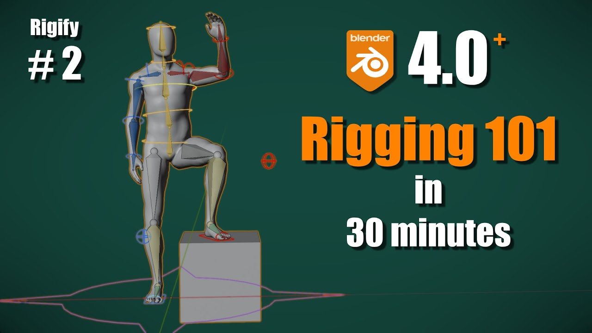](https://www.youtube.com/watch?v=eoird3MVCNw)

## Blender File
[rigging-2024-11-27](../blender/tutoriels/rigging-2024-11-27/)

## Humanoid
J'utilise le fichier d'humanoïde [ch2_simple_character.blend](///blender/tutoriels/rigging-2024-11-27/rigging-2024-11-27-starter.blendps://academy.cgdive.com/courses/rigify-basics/1/lessons/1).

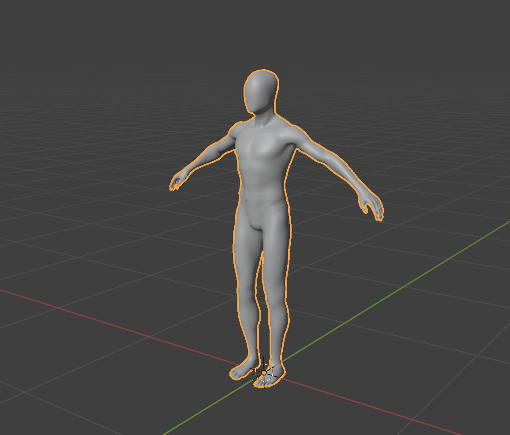

## Notes
Quelques notes sur ce que j'ai compris.

### Cursor To World Origin
`Object` > `Snap` > `Cursor To World Origin`

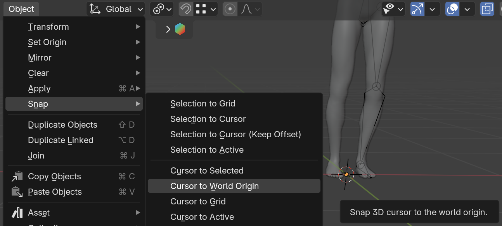

### Parent-Enfant ambigu
Ce n'est pas évident dans quel sens va le lien de parenté entre cette sphère et ce cone :

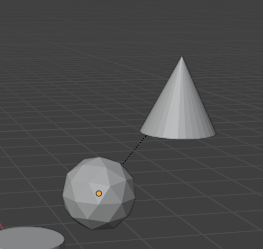

### Head & Tail
Tête versus queue d'un os :

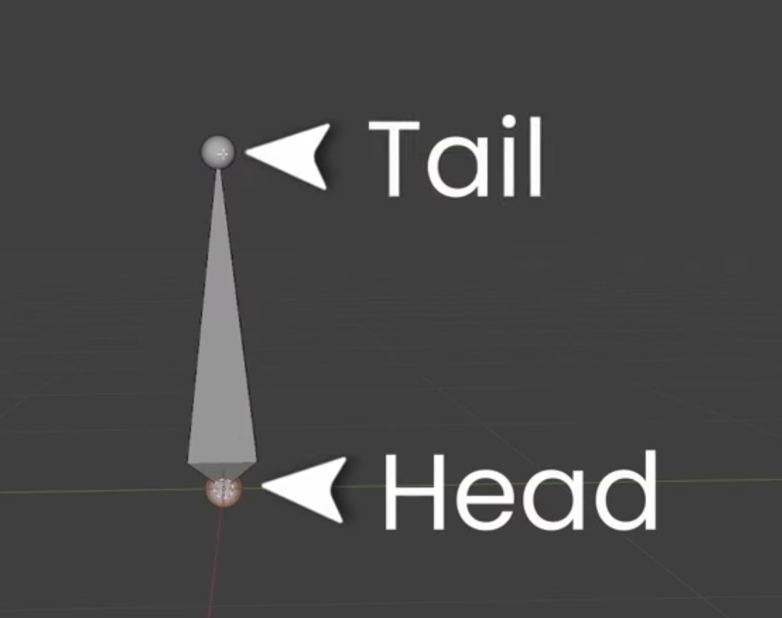

Mnémotechnique : la queue « sort » de la tête comme une queue d'animal.

### Modes armature
Trois modes pour les armatures :
	- Object : où l'armature est placé (cf. root)
	- Edit : les positions **par défaut** (« Rest Positions ») de chaque os, c'est-à-dire sans les transformations du mode *Pose*
	- Pose : les transformations (translate, rotate, scale) que peuvent être animés, et cætera — à partir de transforms **par défaut** du mode *Edit*

En gros : on edit la posture de départ dans *Edit* — par exemple, un T-Pose d'un personnage — puis on anime ce personnage dans *Pose* ; sachant qu'on peut toujours annuler toutes ces transforms animés en sélectionnant `Pose` > `Clear Transform` > `All`.

### Couleur os
Bone Color : Selectionner l'icône de l'os, et changer `Viewport Display` avec la couleur de son choix :

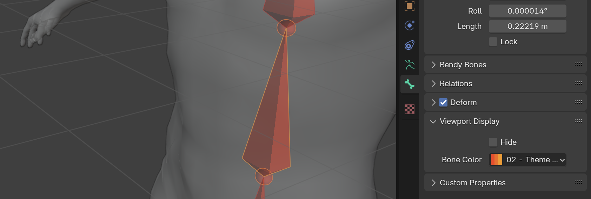

### Noms d'os
On change les noms d'os dans les propriétés `Bone`.

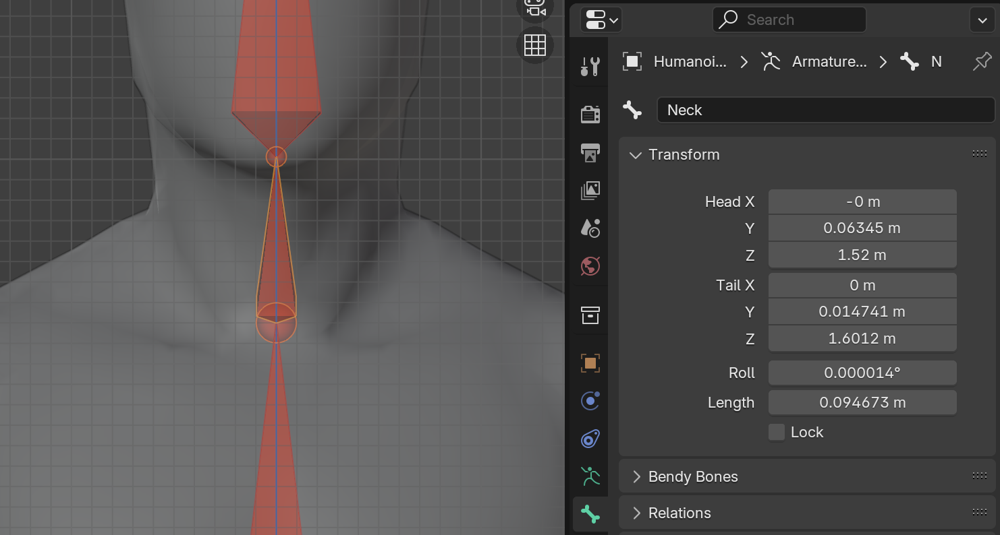

Ces noms apparaîssent aussi dans l'hiérarchie :

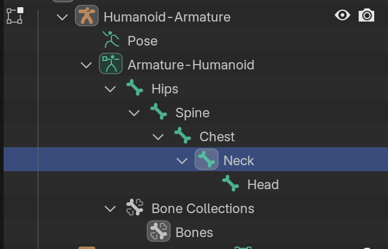

*Note: je ne comprends pas encore la différence entre les propriétés de l'armature qui se trouvent dans `Data`, et les propriétés `Bone`*.

### Pivot Point
Je trouve plus facile à manipuler les os en mode `Individual Origins`, surtout pour le changement d'échelle. Par défaut (je crois que) c'est réglé sur `Median Point`.

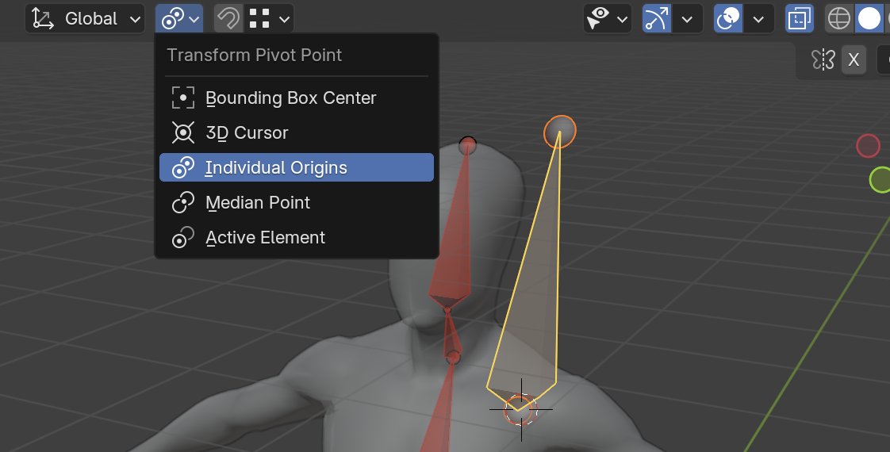

### Search Field
Si les propriétés deviennent tous gris, c'est probablement parce qu'on a tapé quelque chose dans le champ de recherche.

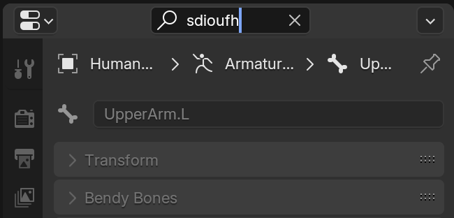

### Disconnect
Si on veut garder un lien de parenté, mais déconnecter les deux os (avec un *offset* donc), on sélectionner les des os, `(clic droit)` > `Parent` > `Clear` > `Disconnect Bone`.

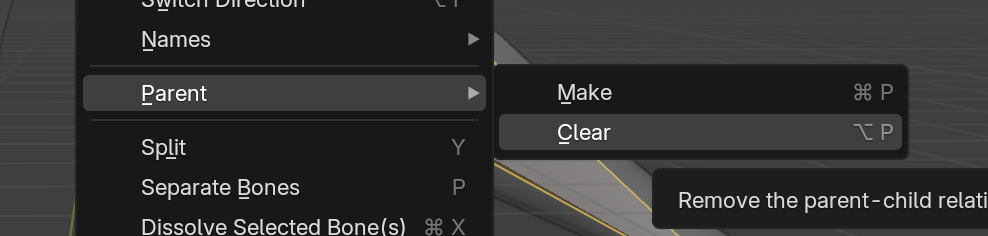 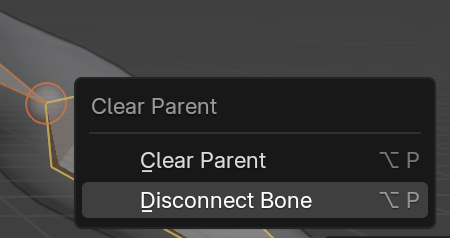

### Symmetrize
Dans `Edit Mode`, sélectionner tous les os.

`Select` > `All`. `Armature` > `Symmetrize`

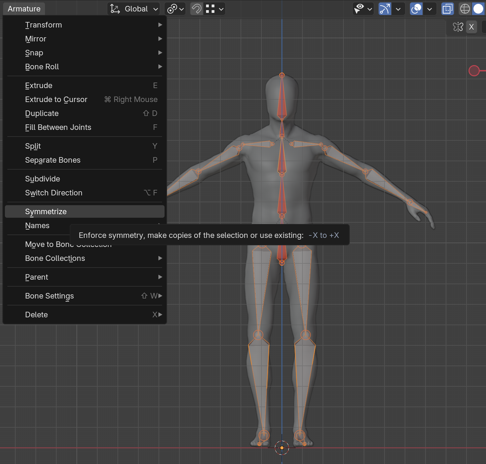

*Attention : pour que cet outil fonctionne bien, les nomenclatures devraient terminer par `L` (si on travaille la partie gauche du personnage), comme `UpperArm.L`. Tous os sans `L` seront traités comme des os centraux, donc sans symmétrie.*

### Unity Naming Convention
J'utilise les noms d'Unity pour mes noms d'os.

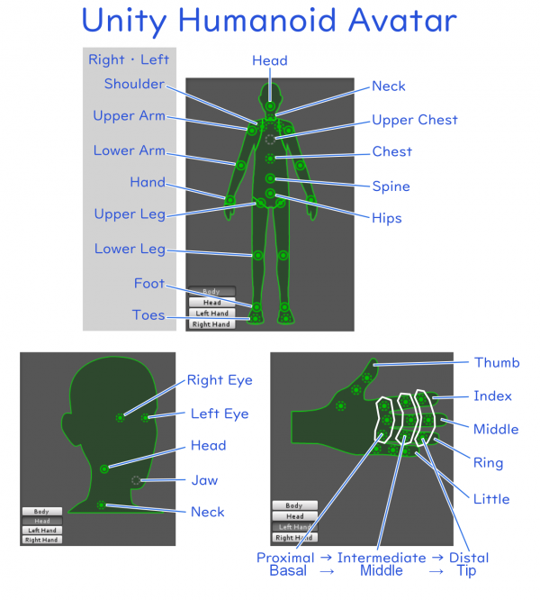 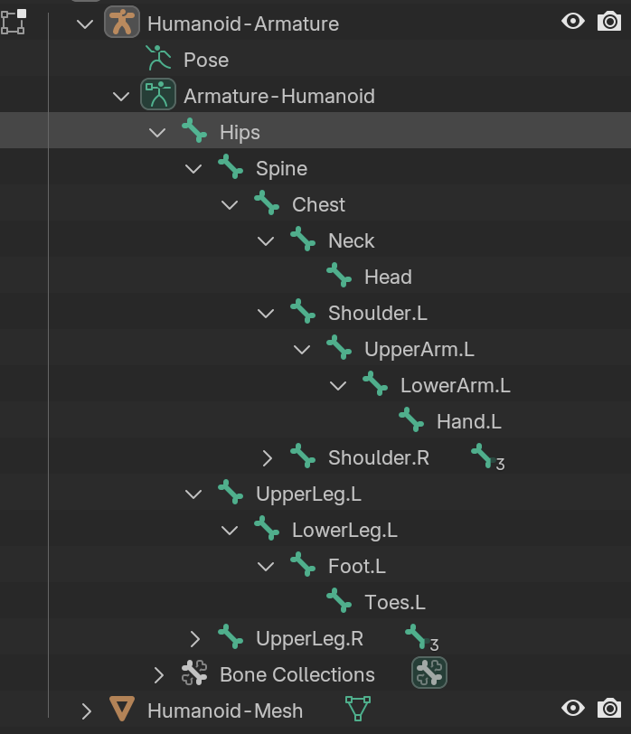