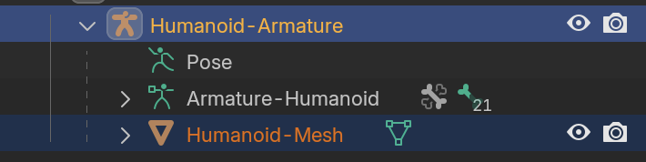

# Tutoriel Rigging 101
Aujourd'hui, j'ai suivi ce tutoriel afin d'avoir une vue d'ensemble des outils d'armature depuis Blender 4 :

*Note: La vidéo dure ~30 minutes. Moi ça m'a pris plusieurs heures pour n'arriver qu'à la moitié :-/*

## Blender File
[rigging-2024-11-27](../blender/tutoriels/rigging-2024-11-27/)

## Humanoid
J'utilise le fichier d'humanoïde [ch2_simple_character.blend](///blender/tutoriels/rigging-2024-11-27/rigging-2024-11-27-starter.blendps://academy.cgdive.com/courses/rigify-basics/1/lessons/1).

## Notes
Quelques notes sur ce que j'ai compris.

### Parent-Enfant ambigu
Ce n'est pas évident dans quel sens va le lien de parenté entre cette sphère et ce cone :

### Head & Tail
Tête versus queue d'un os :

Mnémotechnique : la queue « sort » de la tête comme une queue d'animal.

### Modes armature
Trois modes pour les armatures :
	- Object : où l'armature est placé (cf. root)
	- Edit : les positions **par défaut** (« Rest Positions ») de chaque os, c'est-à-dire sans les transformations du mode *Pose*
	- Pose : les transformations (translate, rotate, scale) que peuvent être animés, et cætera — à partir de transforms **par défaut** du mode *Edit*

En gros : on edit la posture de départ dans *Edit* — par exemple, un T-Pose d'un personnage — puis on anime ce personnage dans *Pose* ; sachant qu'on peut toujours annuler toutes ces transforms animés en sélectionnant `Pose` > `Clear Transform` > `All`.

### Couleur os
Bone Color : Selectionner l'icône de l'os, et changer `Viewport Display` avec la couleur de son choix :

### Noms d'os
On change les noms d'os dans les propriétés `Bone`.

Ces noms apparaîssent aussi dans l'hiérarchie :

*Note: je ne comprends pas encore la différence entre les propriétés de l'armature qui se trouvent dans `Data`, et les propriétés `Bone`*.

### Pivot Point
Je trouve plus facile à manipuler les os en mode `Individual Origins`, surtout pour le changement d'échelle. Par défaut (je crois que) c'est réglé sur `Median Point`.

### Search Field
Si les propriétés deviennent tous gris, c'est probablement parce qu'on a tapé quelque chose dans le champ de recherche.

### [Disconnect](https://youtu.be/eoird3MVCNw?si=OUeBVMAJBReTqO_4&t=689)
Si on veut garder un lien de parenté, mais déconnecter les deux os (avec un *offset* donc), on sélectionner les des os, `(clic droit)` > `Parent` > `Clear` > `Disconnect Bone`.

 

### [Symmetrize](https://youtu.be/eoird3MVCNw?si=glqk45NjkwLgLBF9&t=844)
Dans `Edit Mode`, sélectionner tous les os.

`Select` > `All`. `Armature` > `Symmetrize`

*Attention : pour que cet outil fonctionne bien, les nomenclatures devraient terminer par `L` (si on travaille la partie gauche du personnage), comme `UpperArm.L`. Tous os sans `L` seront traités comme des os centraux, donc sans symmétrie.*

### Unity Naming Convention
J'utilise les noms d'Unity pour mes noms d'os.

 

### Cursor Mode Origin
Avant la prochaine étape, vérifions que le `Cursor` se trouve à l'origine du monde.

`Object Mode` > `Object` > `Snap` > `Cursor To World Origin`

### Parent Mesh to Armature
Nous voulons manipuler notre mesh via l'armature. On vérifie qu'on est donc en `Object Mode`. On `Select None`. On `Select` le mesh (uniquement). Avec `(Shift)` maintenu, on `Select` (clic droit) ensuite l'armature. Cet ordre est important : d'abord l'enfant > `Shift` + le futur parent > `Object` > `Parent` > `With Automatic Weights`.

*Note : si on inverse l'ordre — armature (enfant) > mesh (parent) —, on ne verra pas les options `Automatic Weights`.*

Pour vérifier que le rapport parent > enfant fonctionne, regarde l'hiérarchie. On doit avoir le mesh à l'intérieur de l'armature :

Pour vérifier si les `Automatic Weights` ont fonctionné, va dans `Pose Mode`, sélectionne un os, et fait une rotation. Le mesh devrait bouger avec l'os, et les os qui en dépendent.

### Inverse Kinematics
On va créer un os pour la manipulation de kinématique inverse.

Pour poser des contraintes de kinématique inverse, nous allons dans `Pose Mode`, sélectionner rien, puis ce nouvel os `Leg-LK.L`, puis avec `MAJ` sélectionner l'os `LowerLeg.L`.

Avec cette sélection : `Pose` > `Constraints` > `Add (With Targets)` > `Tracking` > `Inverse Kinematics`.

Passe en `Edit Mode`, sélectionne l'os `Leg-IK.L`, puis `Armature` > `Parent` > `Clear` > `Clear Parent`. Retourne en `Pose Mode`. On veut que l'IK puisse manipuler le bas de la jamble sans être lui-même influencé par cette même jamble (cercle vicieux).

Retourne en `Pose Mode`, sélectionne le bas de la jambe `LowerLeg.L` et dans les propriétés de `Bone Constraints` choisis `2` pour le `Chain Length`.

Pour fixer le pied : dans `Edit Mode`, enlèves le parent du pied `Foot.L`. Puis dans `Pose Mode`, sélectionne le bas de la jambe `LowerLeg.L`, `MAJ` + sélectionne `Foot.L` : `Pose` > `Contraints` > `Add (With Targets)` > `Transform` > `Copy Location` :

Le pied va monter à la tête de l'os :

Mais on peut régler dans les propriétés de la nouvelle contrainte de l'os (`Bone Constraints`), la valeur de `1.0000` pour le rapport `Head/Tail`.

L'idée ici, c'est que le pied a comme contrainte de toujours suivre la position de la queue de l'os, mais sans le rapport parent/enfant.

### Contraindre les axes du mouvement
Sélectionner le bas de la jambe `LowerLeg.L` > propriétés `Bone` > `Inverse Kinematics` > `Lock IK Y` + `Lock IK Z`.

### Deform
L'IK ne modifie pas le mesh. On le sélectionne dans `Pose Mode`, on sélectionne les propriétés `Bone` et on décoche `Deform`.

### Symmetrize
Dans `Edit Mode`, sélectionne `Leg-IK.L`, `MAJ` + `LowerLeg.L` + `MAJ` + `Foot.L`, puis `Armature` > `Symmetrize` :

### Bone Collections
