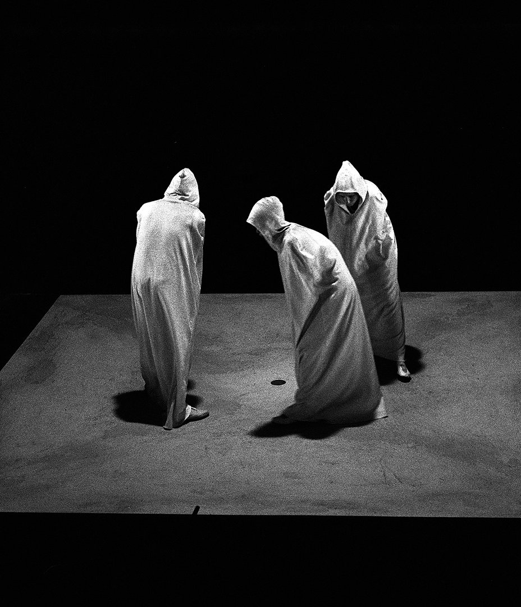
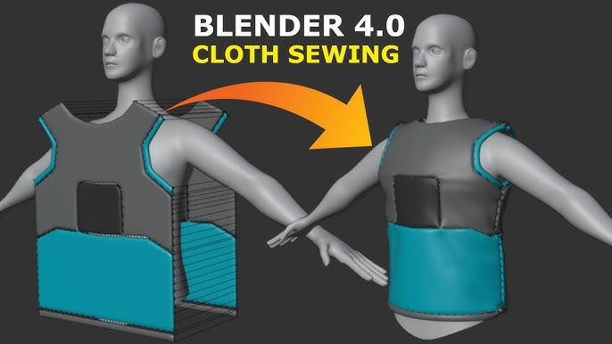
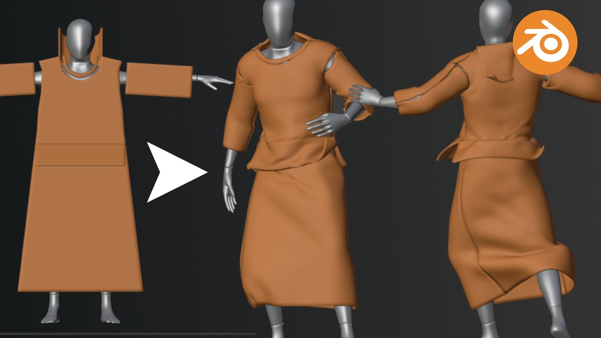
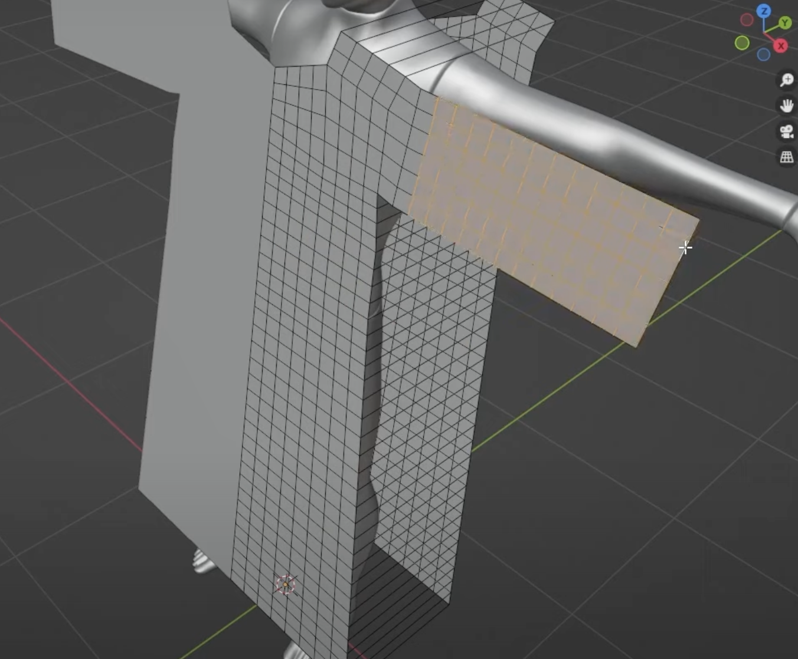
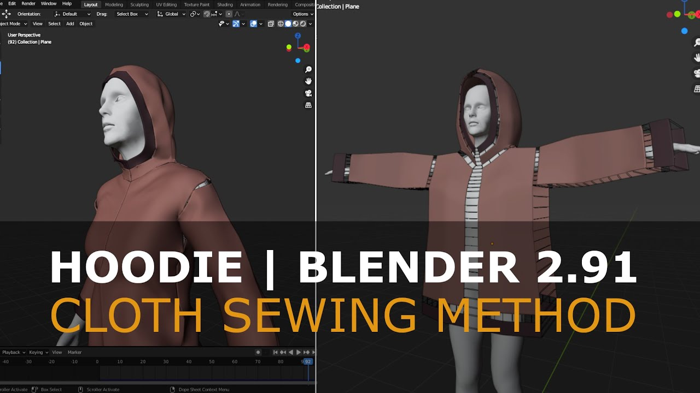

# Process

## Tutoriel Rigging, suite
Continuation du tutoriel du 27 novembre. Cf. les process notes du [2024-11-27](2024-11-27.md). J'ai fini (*enfin*) ce tutoriel des bases du rigging. *Soupirs*.

## Mixamo
Peut-être un workflow bien serait :

[Mixamo](https://www.mixamo.com/) > [Blender](#) > [Unity](#)

C'est-à-dire importer les images-clé de Mixamo dans Blender, les retravailler/nettoyer dans Blender, puis exporter dans Unity.

## Habit
En suivant les [instructions de Beckett](https://rohandrape.net/ut/rttcc-text/Beckett1984d.pdf), j'ai besoin de robes avec capuches pour les quatre personnages.

> *Costumes*
>
> Gowns reaching to ground, cowls hiding faces.

Cf. Kaftan, Djelleba, Thobe, …

## Cloth Simulation
Peut-être une piste :

[Tutorial: Blender 4 Cloth Sewing - Basic Shirt](https://www.youtube.com/watch?v=28tYKUH66KA)

Encore plus proche de mes besoins :

[Blender: Make An Ancient Robe | Cloth Sewing Tutorial](https://www.youtube.com/watch?v=cVlad6dvynU)

Voici la logique générale de ce qu'on doit faire :

Et aussi pour le cap :

[Tutorial: Easy Hoodie - Blender 2.91](https://www.youtube.com/watch?v=PrSWh0ebyCM)

[Female Hoodie Tutorial Blender 3.2 | Cloth Sewing](https://www.youtube.com/watch?v=cUBGYtlFne8)

Il y a aussi une composante [Cloth](https://docs.unity3d.com/Manual/class-Cloth.html) dans Unity. Cf. le tutoriel [How to Use Cloth Simulation in Unity for Stunning Visuals](https://www.youtube.com/watch?v=pZBEiS99VpM)

## L'épuisé
J'ai lu la première partie de « [L’épuisé](http://www.leseditionsdeminuit.fr/livre-Quad_et_autres_pièces_pour_la_télévision-1524-1-1-0-1.html) » de Deleuze. Cette prémière partie construit une sorte de lecture généralisé de Beckett et distinguant « le fatigué » de « l'épuisé ». Dans la deuxième partie il va traiter Quad plus directement, mais dans cette première partie Deleuze traite l'ensemble de l'œuvre de Beckett et surtout ces personnages étranges comme Malloy ou Winnie entourée jusqu'au cou.

L'argument central tourne autour de l'idée d'une œuvre qui tente d'épuiser par différentes stratégies la langue, la parole, l'image, puis l'espace. Deleuze décrit des personnages qui ne sont pas juste allongé (= *fatigués*) ; iels sont plutôt assis-es mais immobilisé-e-s.

Le mot qui semble hanter ce texte — et que Deleuze traite, et écarte, mais avec peu d'insistance — est la question du silence. C'est même la fin du texte. En gros : comment parler du silence dans un texte, dans une pièce, dans un film, dans une émission télévisuelle. C'est proche, de ce point de vue, du projet de Heidegger : comme parler d'une silence étourdissante.

Cette question de silence est une manière de traiter l'extrême épuration de Beckett qui n'est pas un minimalisme. Ce n'est pas une tentative de simplifier le sens ou la représentation ; il s'agit d'un projet plutôt de l'exténuer par un mouvement intérieur.