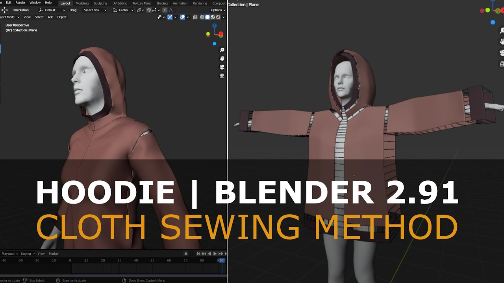
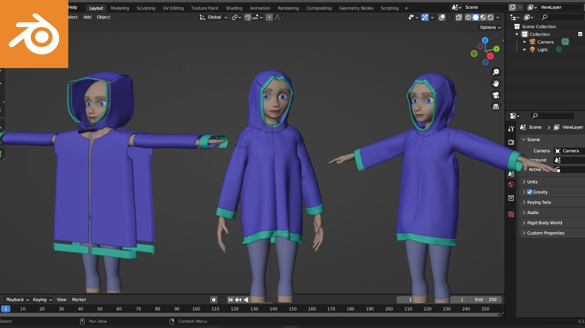

# Sewing
Aujourd'hui j'explore la méthode Blender d'utiliser la physique pour coudre un vetement à partir d'un patron devant et derrière un personnage.

Je vais m'appuyer formement sur ces tutoriels que j'ai trouvé hier :

[Tutorial: Blender 4 Cloth Sewing - Basic Shirt](https://www.youtube.com/watch?v=28tYKUH66KA)

Encore plus proche de mes besoins :

[Blender: Make An Ancient Robe | Cloth Sewing Tutorial](https://www.youtube.com/watch?v=cVlad6dvynU)

Voici la logique générale de ce qu'on doit faire :

Et aussi pour le cap :

[Tutorial: Easy Hoodie - Blender 2.91](https://www.youtube.com/watch?v=PrSWh0ebyCM)

[Female Hoodie Tutorial Blender 3.2 | Cloth Sewing](https://www.youtube.com/watch?v=cUBGYtlFne8)

J'ai regardé deux de ces tutoriels hier soir et ça me semble la bonne méthode, au moins pour démarrer.

## Cloth
Comme j'ai dit [hier](./2024-11-29.md), il y a la composante [Cloth](https://docs.unity3d.com/Manual/class-Cloth.html) dans Unity. Cf. le tutoriel [How to Use Cloth Simulation in Unity for Stunning Visuals](https://www.youtube.com/watch?v=pZBEiS99VpM).

