# Notes

## Lecture
J'ai continué [la lecture de Deleuze de Quad](./quad.md#2024-12-01), surtout la deuxième partie, avec une exploration du concept que [Laura Salisbury](https://wcceh.org/meet-the-team/academics/professor-laura-salisbury/) appelle le [Grey Time](./quad.md#grey-time).

## Cloth
Continuation du travail sur le vêtement (cf. [cloth](../blender/project/cloth-2024-11-30/)).

Voici le vêtement avant de faire les indication de couture.

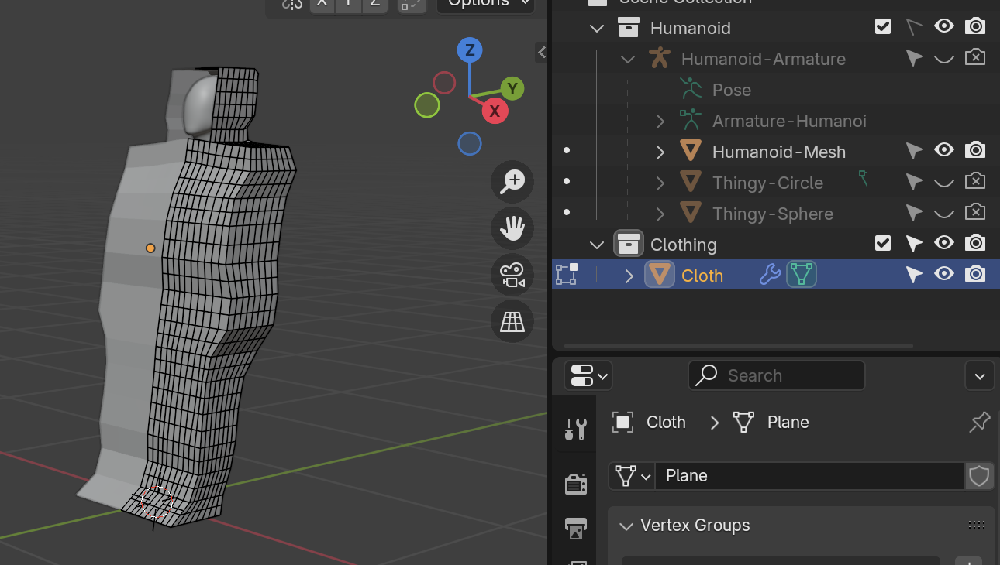

Voici les endroits de coupure selon [le tutoriel de Pixxo 3D](https://youtu.be/cUBGYtlFne8?si=pWUjcPXWwrWP4r4v).

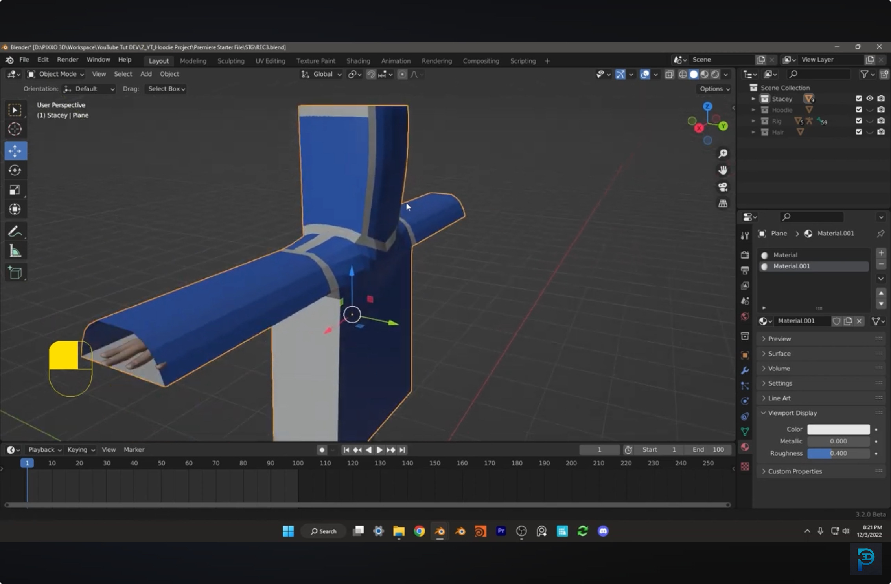

## Normals
Les `normals` sont dans le mauvais sens :

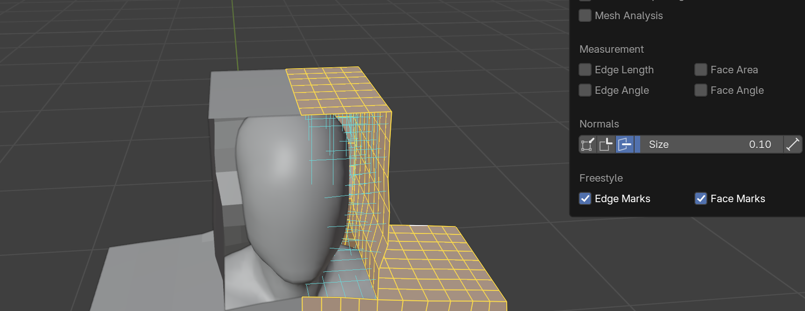

Pour réparer, sélectionner tout (`ctrl` + `a`), puis `Edit Mode` > `Mesh` > `Normals` > `Recalculate Outside` :

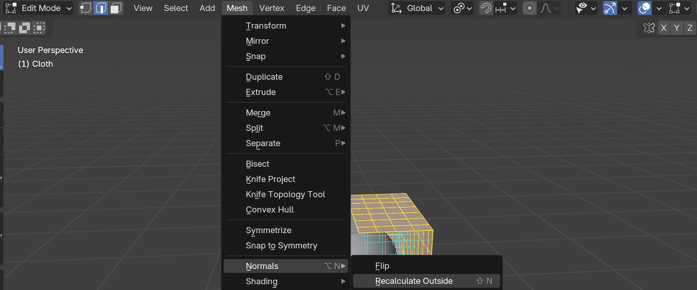

Ce qui devrait ré-orienter les normals vers l'extérieur :

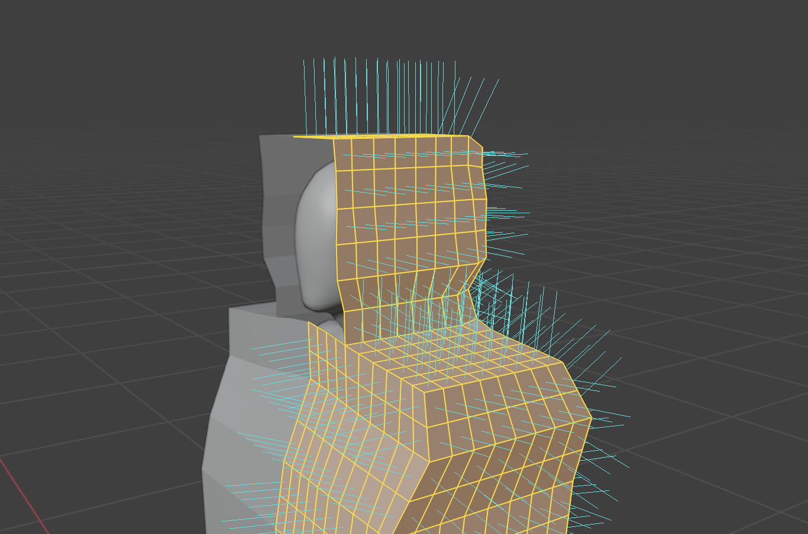

## Lien de coupure
Il faut indiquer quelle partie doit être cousu avec quelle partie. On enlève à ces endroits les faces, mais on garde les sommet. Blender utilisera ces liens (en gros des lignes qui indique « cette face sera cousu à cette face, via ce sommet ») pour déterminer les endroits de couture.

Pour faire cela, il faut sélectionner les faces, puis effacer uniquement les face (`Only Faces`) :

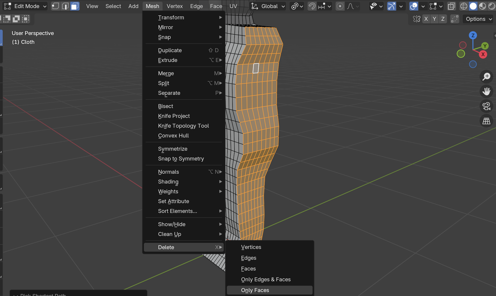

Ce qui donnera quelque chose comme ceci :

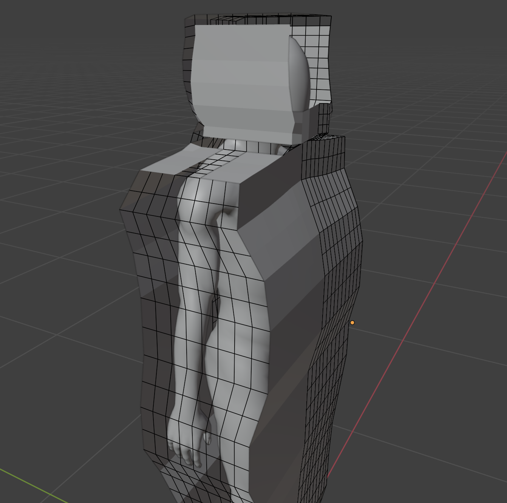

Voici avec un matériel pour mieux voir :

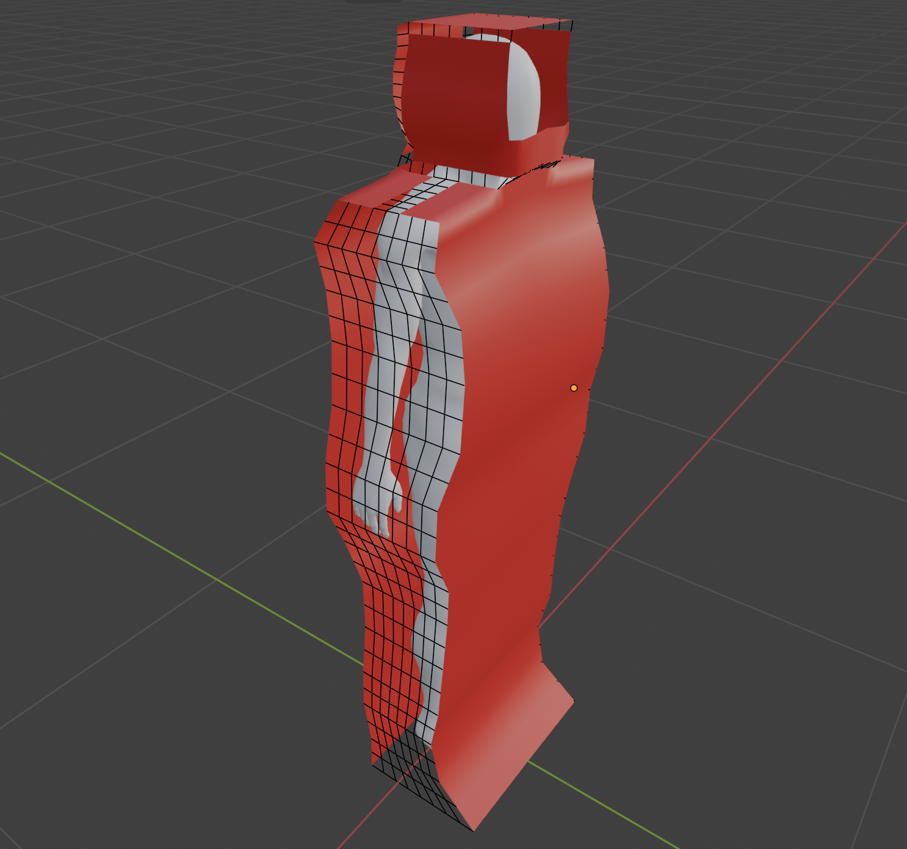

## Collision
Il faut sélectionner le personnage à l'intérieur et activer ses `Properties` > `Physics` > `Collision`.

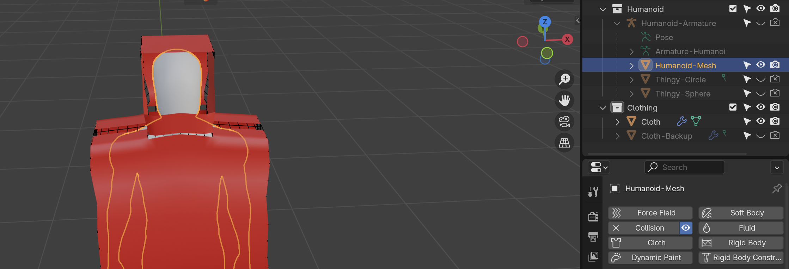

Puis sélectionner dans `Object Mode` l'objet du vêtement et activer `Properties` > `Physics` > `Cloth`

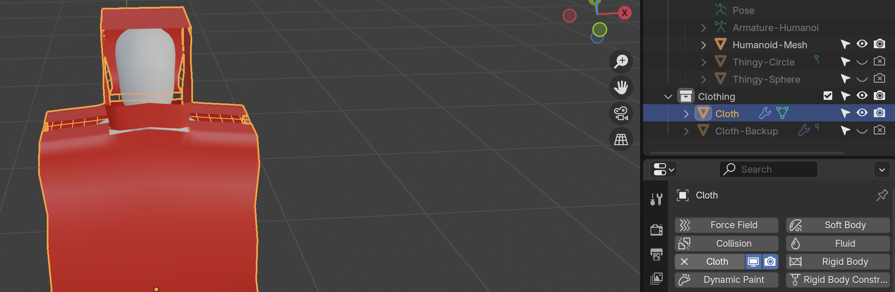

Selon [ce tutoriel de Pixxo 3D](https://youtu.be/cUBGYtlFne8?si=skE7glwfmerjCn2M), il faut activer `Properties` > `Physics` > `Cloth` > `Shape` > `Sewing`, donner une valeur de `12` pour le `Max Sewing Factor`, `0.1` pour le `Shrinking Factor`. Dans `Collisions` il a activé `Self Collisions` et lui a donné une valeur de `0.001` pour `Self Collisions` > `Distance` :

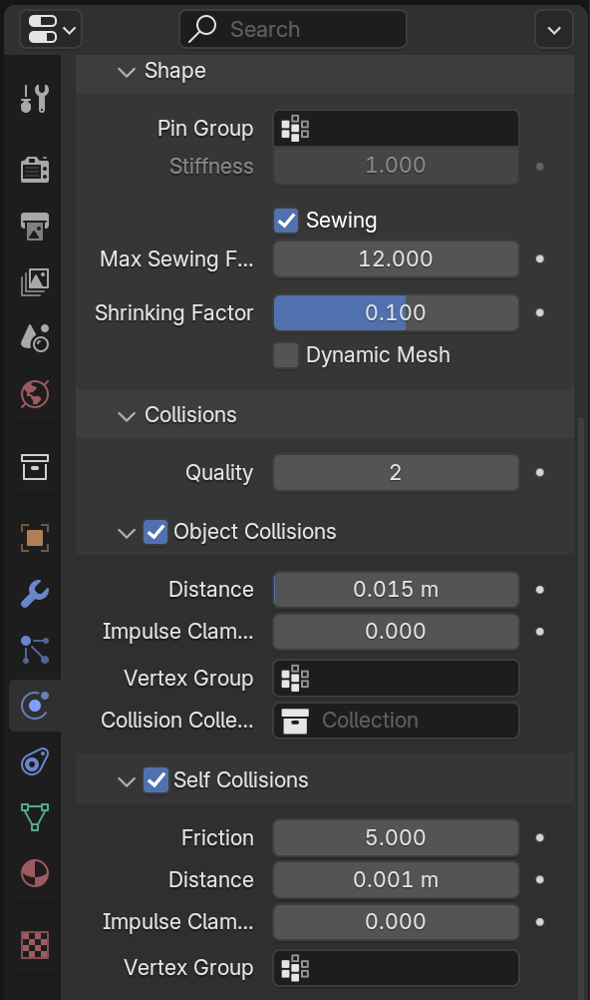

## Mauvais résultats
Les résultats sont plutôt décevants. Je suis content d'avoir au moins réussi à faires les réglages de base, mais je dois probablement commencer à mieux comprendre les paramètres comme `Self Collisions`et `Shrinking Factor` afin d'obtenir des résultats intéressants.

