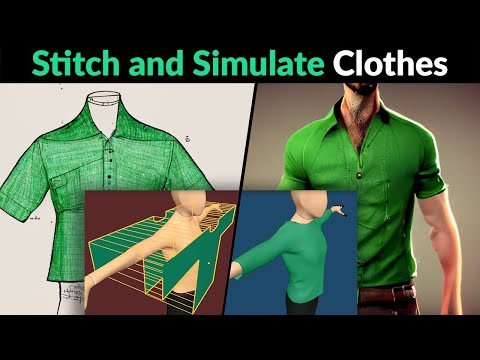
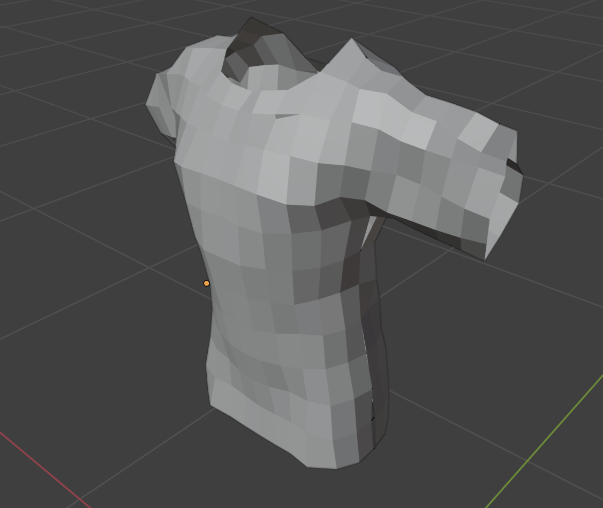
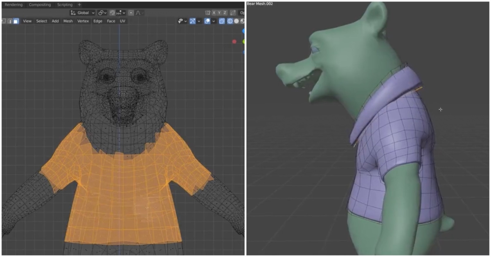
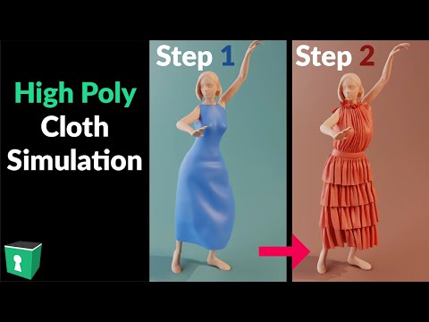
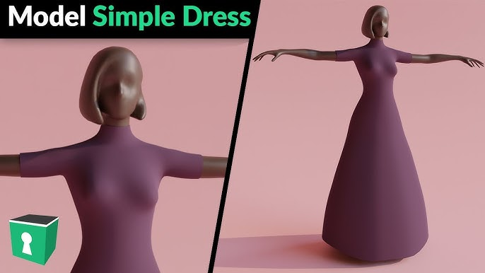
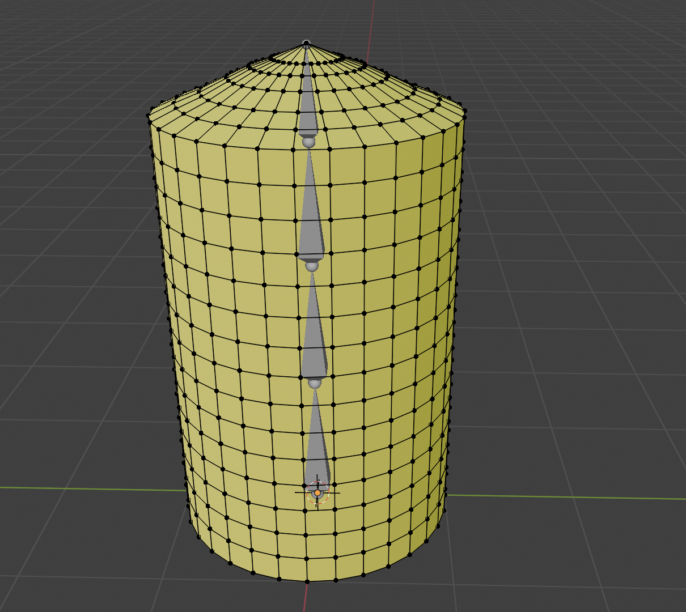
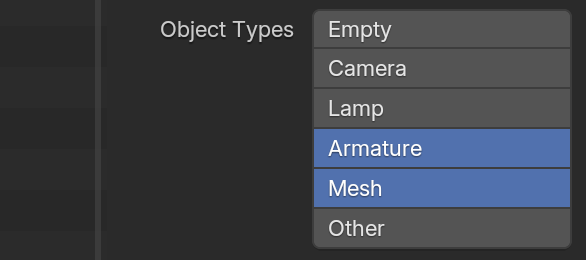
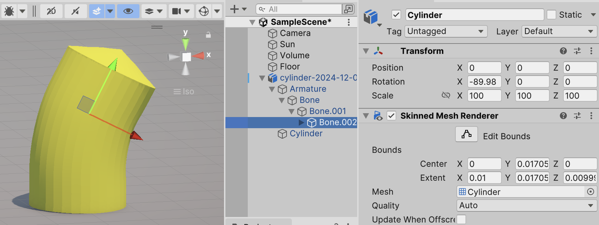
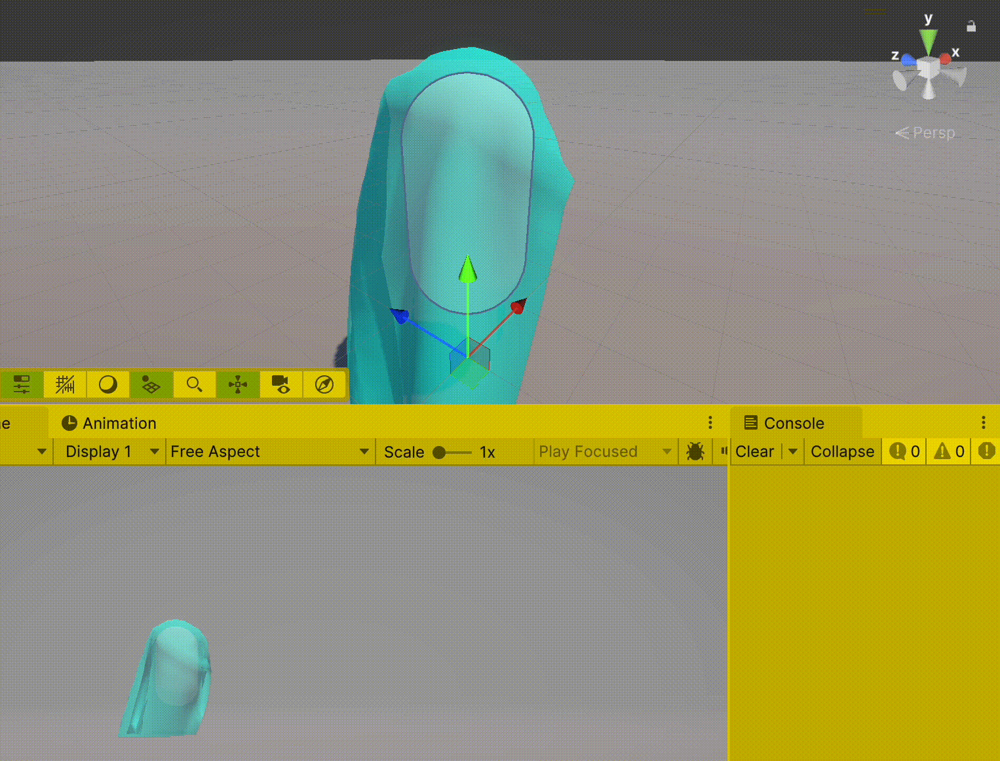

# Notes
Je me rend compte que ça ne va pas me faire beaucoup avancer d'avoir Blender faire le travail de modélisation du vêtement pour moi.

## Alternative
Les *tips* de [Blender Secrets](https://www.blendersecrets.org) sont toujours excellents. Par exemple, ce tutoriel, avec la même technique que [2024-11-30](./2024-11-30.md), est très bien :

J'ai suivi ce tutoriel simple et les reglages me donnent preque parfaitement ce que je cherchait :

Les résultats se trouvent dans ce fichier [blender-secrets-cloth-2024-12-08](../blender/tutoriels/cloth/blender-secrets-cloth-2024-12-08.blend).

Mais dans ce tutoriel, il suggère une autre méthode, qui me semble mieux pour me besoins. C'est une approche plus classique qui consiste à sélectionner un ensemble de vertices, puis de les écarter du corps :

## Dress

Il y a aussi ces deux tutoriels de Blender Secrets autour de la création d'une robe, ce qui est plus proche de mes besoins.

## Cylindre
[Claudy Ianonne](https://www.hesge.ch/head/annuaire/claudy-iannone) a suggéré de tester un simple cylindre, d'ajouter des faces sur ce cylindre, puis et de voir comment Unity traite ce cylindre augmenté. Je vais aussi tester cette approche, en commençant même par un simple cylindre.

Dans Blender, j'ai fabriqué un cylindre. Dans la documentation [Cloth](https://docs.unity3d.com/Manual/class-Cloth.html) de Unity, on explique qu'il faut absolument un `Skinned Mesh Renderer` et pas juste un `Mesh Renderer`. Normal, puisqu'il faut pouvoir déformer le `Mesh` et il faut des poids (`Weights`) sur ce maillage :

Pour que Unity puisse déformer ce maillage, il faut faire `Export` depuis Blender avec l'option `Armature` activé :

Ce qui donne dans Unity un maillage déformable :

Pas sûr qu'il fallait ajouter l'armature côté Blender ; peut-être il aurait suffit de juste exporter avec l'option `Armature` activé.

## Unity Cloth Simulation
J'ai ajouté une capsule à l'intérieur de l'armature côté Unity, puis j'ai ajouté un `Cloth component` sur le `GameObject` qui contenait le `Skinned Mesh Renderer`. Il faut mettre ce `component` directement dans ce dernier, et pas dans le parent de cet objet. Ensuite j'ai placé une capsule à l'intérieur de l'os le plus haut de l'armature, puis j'ai dit au `Cloth` que je voulais que cette capsule sert de physique pour la simulation. Ça donne ceci :

C'est assez convaincant ce résultat. Avec un vêtement bien fait dans Blender, et avec une texture bien fait, ça risque d'être plutôt bien.

