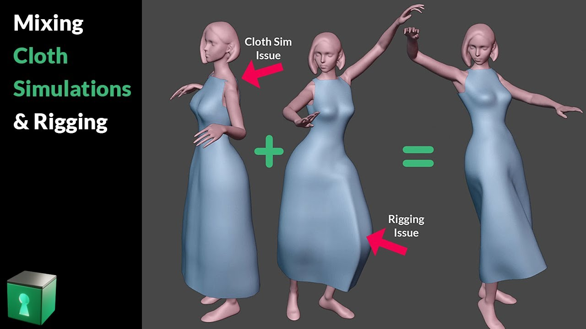
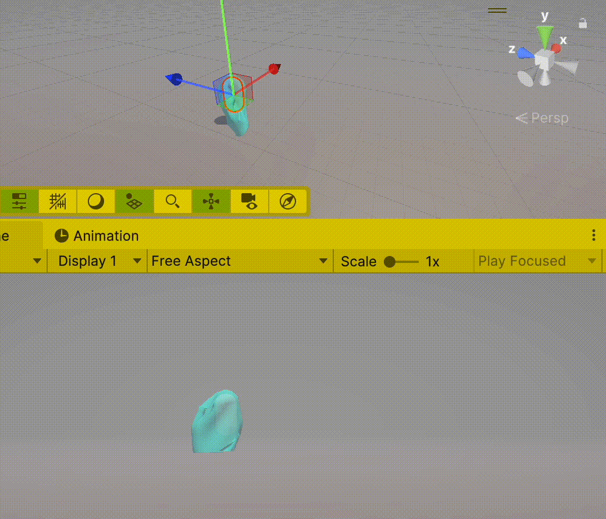

# Notes
Je me rend compte que ça ne va pas me faire beaucoup avancer d'avoir Blender faire le travail de modélisation du vêtement pour moi.

## Alternative
Les *tips* de [Blender Secrets](https://www.blendersecrets.org) sont toujours excellents. Par exemple, ce tutoriel, avec la même technique que [2024-11-30](./2024-11-30.md), est très bien :

J'ai suivi ce tutoriel simple et les reglages me donnent beaucoup mieux ce que je cherchais :

Les résultats se trouvent dans ce fichier [blender-secrets-cloth-2024-12-08](../blender/tutoriels/cloth/blender-secrets-cloth-2024-12-08.blend).

Mais dans ce tutoriel, il suggère une autre méthode, qui me semble mieux pour me besoins. C'est une approche plus classique qui consiste à sélectionner un ensemble de vertices, puis de les écarter du corps :

## Dress

Il y a aussi cette série de tutoriels de Blender Secrets autour de la création d'une robe, ce qui est plus proche de mes besoins.

Je tenterai ces tutoriels plus tard dans la semaine.

## Cylindre
[Claudy Ianonne](https://www.hesge.ch/head/annuaire/claudy-iannone) a suggéré de tester un cylindre, d'ajouter des faces sur ce cylindre, puis voir comment Unity traite ce cylindre augmenté. Je vais tester cette approche ici.

Dans Blender, j'ai fabriqué un cylindre. Dans la documentation [Cloth](https://docs.unity3d.com/Manual/class-Cloth.html) de Unity, on explique qu'il faut un `Skinned Mesh Renderer` et pas un simple `Mesh Renderer` classique. Normal, puisqu'il faut pouvoir déformer le `Mesh` et du coup il faut des poids (`Weights`) attibués sur ce maillage :

Pour que Unity puisse déformer ce maillage, il faut faire `Export` depuis Blender avec l'option `Armature` activé :

Ce qui donne dans Unity un maillage déformable :

Pas sûr qu'il fallait ajouter l'armature côté Blender ; peut-être il aurait suffit de juste exporter avec l'option `Armature` activé. Je ne sais pas. En ce qui nous concerne, nous allons nous servir de toute façon des `Bone` pour placer quelques `Capsule Collider` dans Unity. On suit alors la chaîne classique : `Mesh` + `Armature` + `Animation`.

## Unity Cloth Simulation
J'ai ajouté une capsule (avec son composant `Capsule Collider` par défaut) à l'intérieur de l'armature côté Unity, puis j'ai ajouté un `Cloth component` sur le `GameObject` qui contenait le `Skinned Mesh Renderer`. J'ai augmenté légèrement la taille du `Capsule Collider`, pour éviter que la peau de l'objet traverse le tissu déformable. Il faut mettre le `component` `Cloth` directement sur le `GameObject` du maillage (celui avec le `Skinned Mesh Renderer`), et non pas sur le parent de cet objet.

Ensuite j'ai placé une capsule à l'intérieur de l'os le plus haut de l'armature, puis j'ai dit au `Cloth` que je voulais que cette capsule sert de physique pour la simulation. Évidemment on veut limiter le nombre de capsules pour les calculs du `Cloth`. Ça donne ceci :

Ce résultat est assez convaincant. Avec un vêtement bien fait dans Blender, avec de la capture du mouvement de [Mixamo](https://www.mixamo.com) ou de [Move AI](https://www.move.ai/single-camera), et enfin avec une texture bien fait, ça risque d'être plutôt bien.