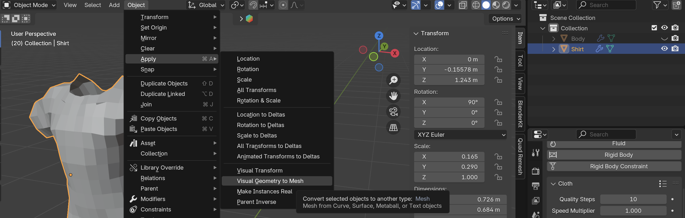
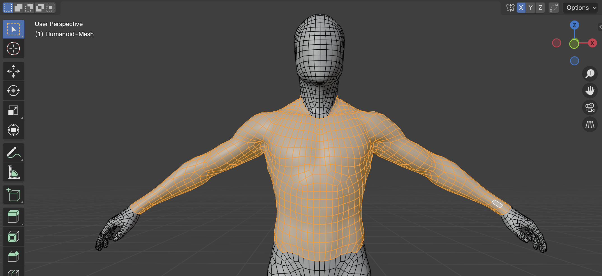
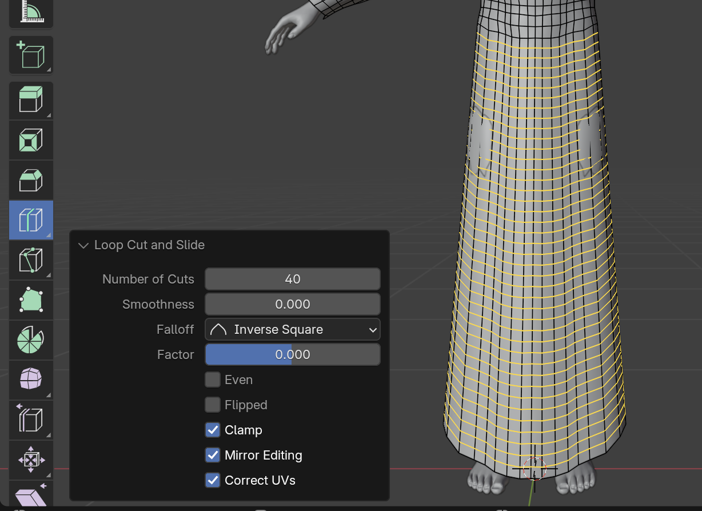
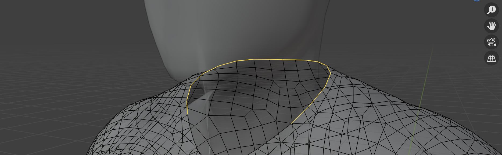
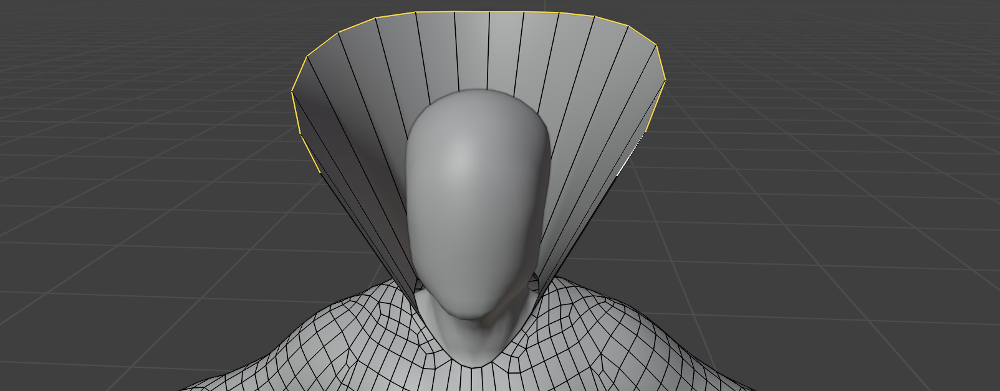
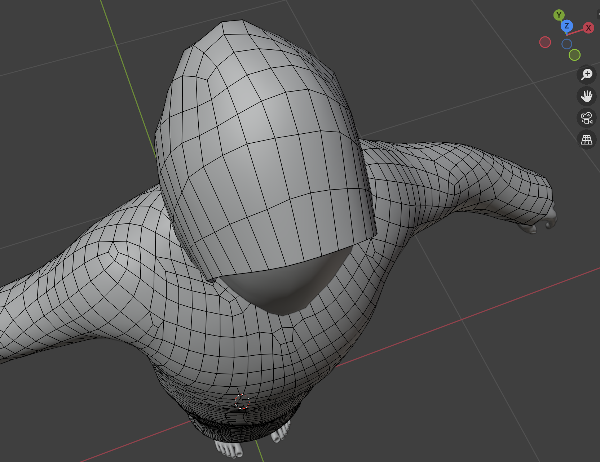
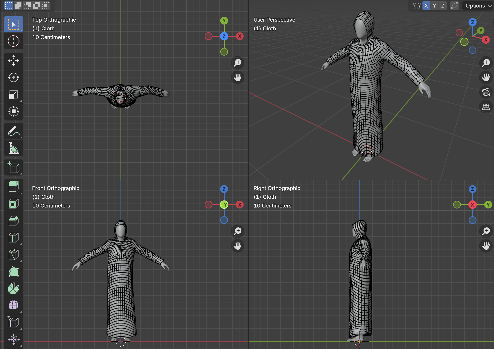
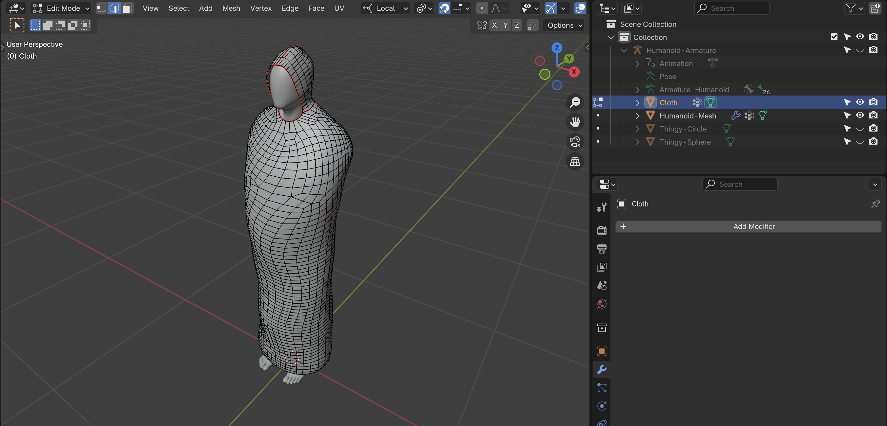
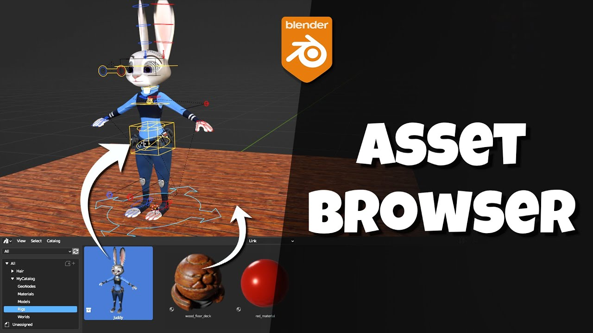
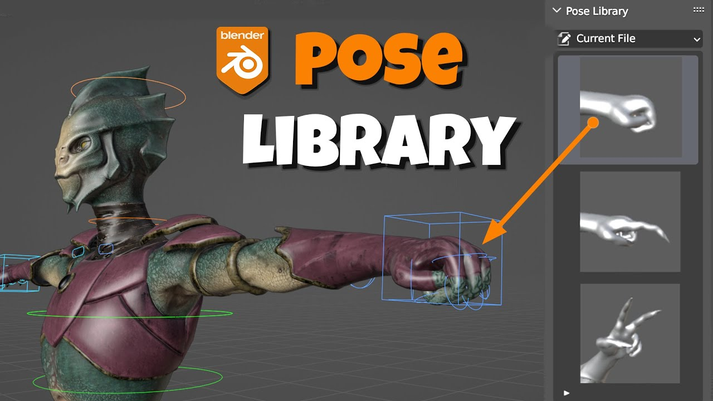

# Cloth Simulations
Si, lorsqu'on travaille par la méthode simulation `Physics` pour générer la forme avec un `Cloth`, nous voulons transformer le résultat en un nouveau `Mesh` pour le travailler (en gros pour modeliser à partir d'une simulation physique), il faut :

- Créer la simulation physique avec le modificateur `Cloth`
- Calculer cette simulation
- Appliquer les résultats de cette simulation avec un `Bake` dans `Cloth`
- Choisir le `Frame` préféré dans `Animation`
- Appliquer cette forme avec `Object` > `Apply` > `Visual Geometry to Mesh`
	- Cette action va enlevé toutes les `Frame` d'`Animation`

# Tunique
Aujourd'hui je vais recommencer avec l'idée de fabrique une tunique à partir d'un cylindre et d'explorer également l'idée de prolonger les vertex à partir du corps de mon modèle.

## Simple Dress
Je commence à partir du tutoriel sur le [Simple Dress](https://www.youtube.com/watch?v=k4q0N5ZRazI). Je commence avec mon [Armature de base](../blender/project/armature-2024-11-30/armature-2024-11-30.blend), puis en `Edit Mode` je sélectionne la partie du corps autour duquel je vais construire la tunique.

### Soucis
J'ai un comportement bizarre. Normalement on veut faire ceci :

- Dupliquer (`Mesh` > `Duplicate`)
- Changer d'échelle via les normales (`ALT` + `S`)
- Séparer la sélection (`Mesh` > `Selection`)

~~Mais pour y arriver doit faire le processus suivant :~~

- Dupliquer (`Mesh` > `Duplicate`)
	- Déplacer sur l'axe X 10 unités (touche `X` + `10` + `ENTER`)
- Séparer la sélection (`Mesh` > `Selection`)
- Changer de mode vers `Object Mode`
- Sélectionner le nouvel objet
- Ramener au point de départ
	- Grab (`G`) -10 unités sur l'axe X (`X` + `-10`)
- Revenir à `Edit Mode`
- Changer d'échelle via les normales (`ALT` + `S`)
- Suivre le reste du tutoriel

### Résolution
On a regardé avec [Claudy](https://www.hesge.ch/head/annuaire/claudy-iannone). Le soucis était tout %$*. J'avais activé l'effet miroir. Alors, pourquoi le miroir donnait cet effet ? C'est subtile. Mais au moins en le désactivant ça marche.

### Prolonger
Toujours en suivant le tutoriel, il faut sélectionner (`Edge Select`) les arrêtes en bas, extruder vers le bas (touche `Z` pour contraindre sur l'axe Z)

### Loop Cut
Si j'utilise le bouton loop cut pour ajouter des faces, j'ai actuellement une quarantaine de `Loop Cut`.

### Sculpting
Toujours en suivant le tutoriel, j'ai passé en `Sculpt Mode` avec mon nouvel objet — que j'ai nommé `Cloth` — et puis j'alterne entre `Smooth` et `Grab` pour créer la longue partie robe autour du corps, puis pour l'écarter des muscles pour que ces derniers ne passent pas à travers. À la fin, je désactiverais ces mesh pour qu'ils ne risquent pas de traverser, mais c'est bien aussi que ça marche comme ça ici.

### Capuche
Je vais utiliser la même technique pour créer la capuche — c'est-à-dire sélectionner les `Edge` et les extruder vers l'axe positif `Z`.

Ce qui donne une sorte de collier de Dracula :

Ensuite j'ai fermé la capuche en haut en vérifiant de toujours avoir des quads.

Puis, beaucoup d'outils de `Sculpt Mode` entre `Grab` et `Smooth`. Au final ça donne ça :

Maintenant il faut refaire cette robe sans les manches.

### Armless Tunic
Voici la version sans bras :

# Blender Pose Library
Pour créer une pose avec les bras à l'intérieur de la tunique, il va falloir comprendre les `Pose Library`. Et pour comprendre cela, il faut d'abord comprendre les `Asset Libraries` :

Ensuite on peut apprendre les `Pose Libraries` :

