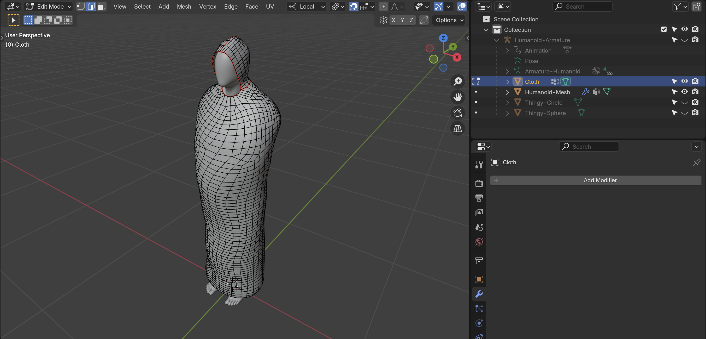

# Cloth, suite
Pour rappel, je me refère à cette vue d'une performance plutôt récente de la pièce :

Et voici ma tunique actuelle :

## T-Pose vs Folded-Arms Pose
J'ai besoin de :

- Créer deux `Pose` :
	- Folded-Arms Pose
	- T-Pose, principalement pour [Mixamo](http://mixamo.com)
- Modéliser la chemise autour de la torse en bras croisés
- Ajouter/modifier les `Weight` de la tunique qui doivent être contrôlés par l'armature
	- Sinon, re-attacher la tunique au corps d'origine et même effacer (ou rendre transparent) des faces à l'intérieur de la tunique
	- Pour l'instant j'exporte comme deux objet séparés : `cloth-no_body.fbx` et `body-no_cloth.fbx`

## Blend Export
Pour l'instant je sélectionne les deux parties que je veux exporter — ici, le `Cloth` et l'`Armature` - dans l'interface Blender :

Pour rappel : il faut l'armature parce que Unity a besoin de traiter le `Cloth` comme un `Skinned Mesh Renderer` et non pas un simple `Mesh` solide. Le `Mesh` Blender a donc besoin d'être exporté avec l'armature avec laquelle elle est reliée.

Puis je coche l'option `Limit To Selection` dans l'interface d'`Export .fbx`. Je choisis également les options `Armature` et `Mesh` et (pour l'instant) j'ignore le reste :

## Unity Import
J'ai commencé à importer dans Unity pour comprendre le workflow.

### Backface Culling
Petit soucis, il faut créer un mesh intérieur pour la capuche puisqu'on ne rend pas les intérieur des `Mesh`. Mais attention à ne pas faire tout l'intérieur du `Cloth` non-plus :

