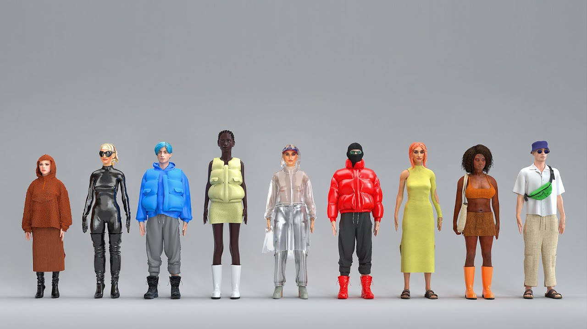
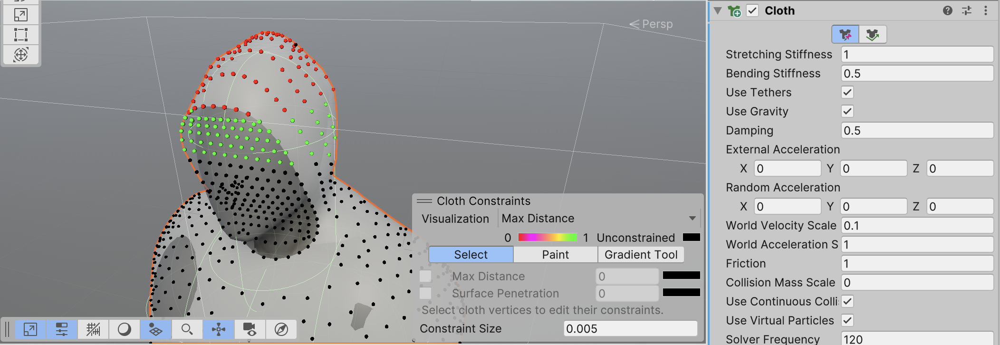
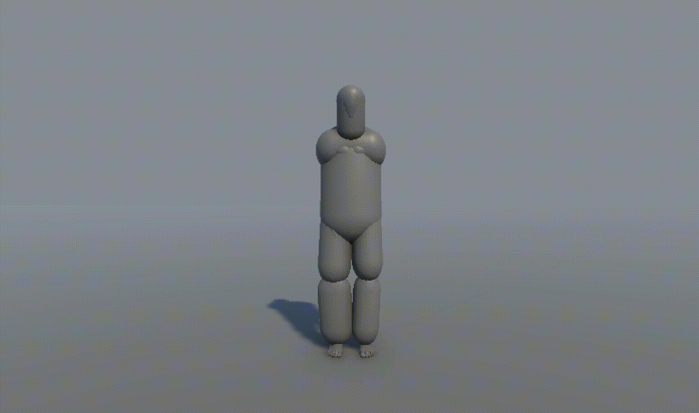
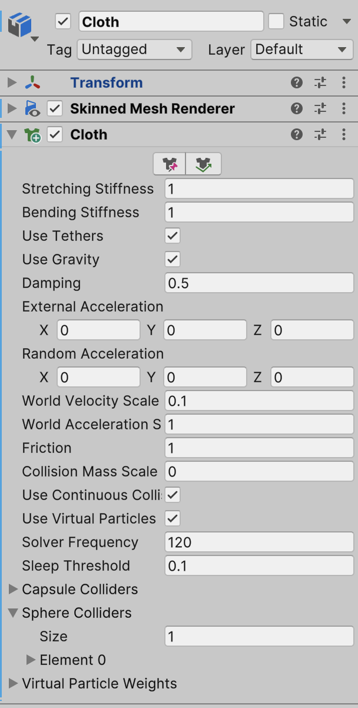
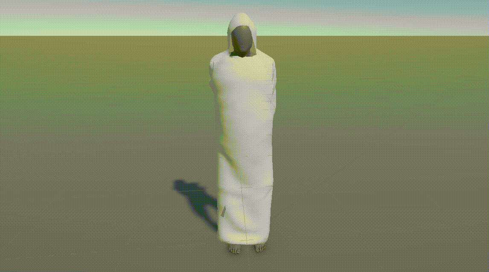
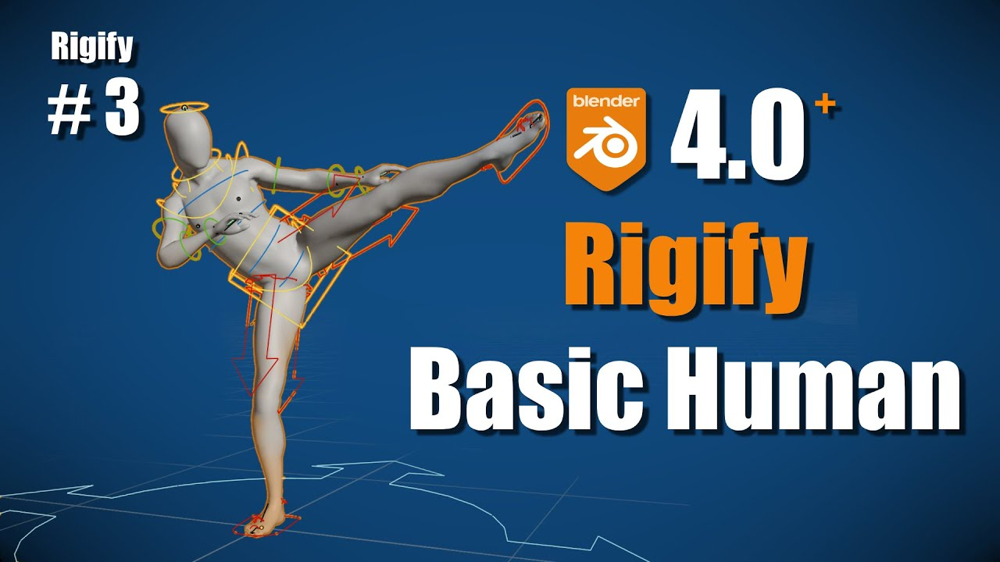

# More Clothing
Voici une vidéo intéressante qui traite la modélisation de vêtements dans Blender :

### Working
Après la simulation craignos d'hier (cf. [WTF](./2024-12-14.md#WTF)), voici la solution que j'ai trouvé aujourd'hui pour avoir des vêtements qui restent cette fois-ci sur le corps. *Phew*. La solution nécessitait l'utilisation des `Cloth Constraints` dans Unity (cf. le bouton rouge `Edit Cloth Constraints` dans le composant `Cloth`) :

J'ai fait ces réglages vite-fait. Il y a probablement beaucoup de mini-réglages à faire par la  suite.

Ensuite, on rajoute plusieurs capsules aux joints et ça crée des collisions à peu près en suivant les contours du corps. Plus de capsules (sphères aussi sont possibles) donnerait plus de finesse, mais en contrepartie plus de calculs :

### Cloth Parameters
Voici les valeurs qui (plus ou moins) marche(ouille) :

Et le résultat avec ces valeurs :

Là je commence à me raprocher de mon images de réference :

# Humanoid + Rigify
Maintenant que j'ai à peu près le workflow d'un humanoïde (Blender) qui s'importe avec son vêtement dans Unity, je peux refaire tout le processus avec une `Armature` plus propre.

Je pense que cette vidéo va me servir pour cette nouvelle base :

