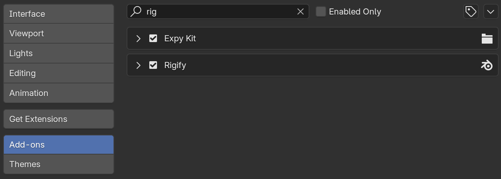
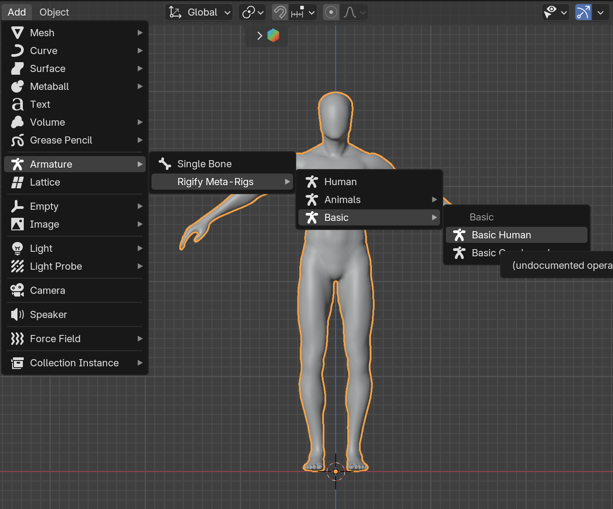
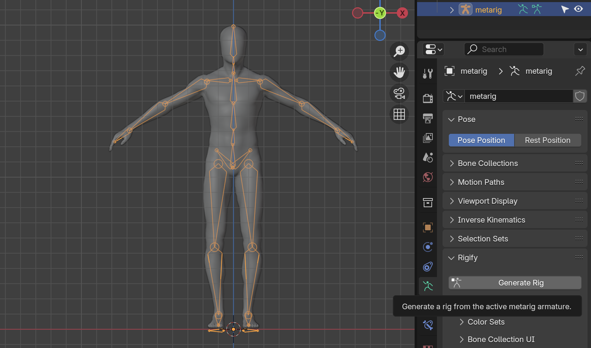
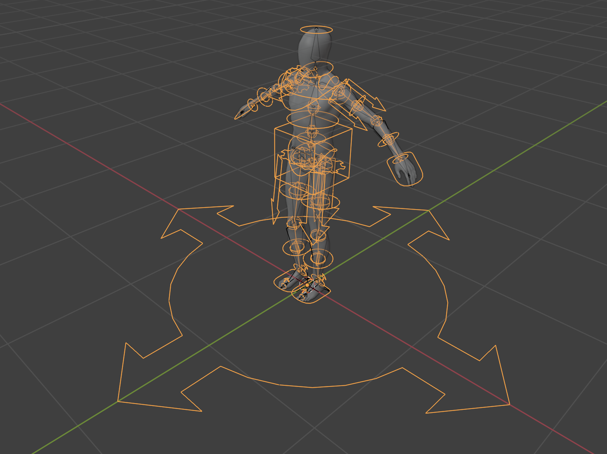
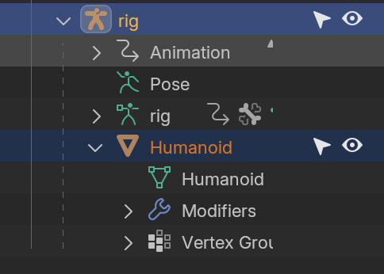

# Project
Je commence avec un nouveau fichier de [Project](../blender/project/project-2024-12-16/).

## Make Local
Puisqu'il s'agit d'un objet linké d'un autre projet Blender, j'ai du créer une version locale sans relation à l'originale : `Objects` > `Make Local` > `All`.

J'ai aussi appliqué une nouvelle échelle : `Object Mode` > `Object` > `Apply` > `Scale`. Pour être compatible Unity, mon personnage fait 2m. Dans Unity, 2m est à peu près la taille standard d'un personnage (cf. taille d'une capsule, etc). Les cubes et sphères sont 1m.

## Blender > Mixamo > Blender
Un workflow intéressant que je voudrais tester plus tard serait de commencer avec un humanoïde sans `Armature`, l'exporter en `.fbx` vers Mixamo, puis créer une armature automatique dans [Mixamo](https://mixamo.com) pour enfin l'exporter de nouveau de Mixamo et l'importer dans Blender.

Ça me permettrait d'imaginer un workflow où je pourrais modéliser librement un personnage dans Blender, puis l'exporter vers Mixamo en m'assurant que le personnage serait toujours Mixamo-compatible. C'est aussi probablement plus simple pour mes élèves.

## Mixamo > Blender + Rigify
Mais l'approche que je vais choisir c'est d'ajouter un [Rigify]() à un modèle sans armature, puis importer Mixamo par dessus via [Expy Kit](https://github.com/pKrime/Expy-Kit).

### Création armature

Je démarre avec le même personnage qu'au début de cette formation : [rigging-starter.blend](../blender/tutoriels/rigging/rigging-starter.blend).

Pour apprendre tout ça, je suis en train de suivre le [Chapter 3: Rigging a Simple Human](https://youtu.be/dDNUjGgCNys?si=fQ3rewbcwi2hBQ1O) de [CG Dive](https://cgdive.com).

Woah, trop de UI !!!

### Binding Weights
Quand le mesh de l'humanoid et l'armature sont tous les deux visuellement alignés, on créé un rapport parent-enfant avec les `Weight` automatiques :

Ce qui donne cette structure dans le `Hierarchy` :

### Ajouter Mixamo
Je vais utiliser le [Workflow #2](https://youtu.be/ars_rEC3oP8?t=1266&si=TlV4xaWmZTI4hRQP) du tutoriel [Blender Expy Kit addon: Mixamo to Rigify](https://youtu.be/ars_rEC3oP8?si=TlV4xaWmZTI4hRQP)

