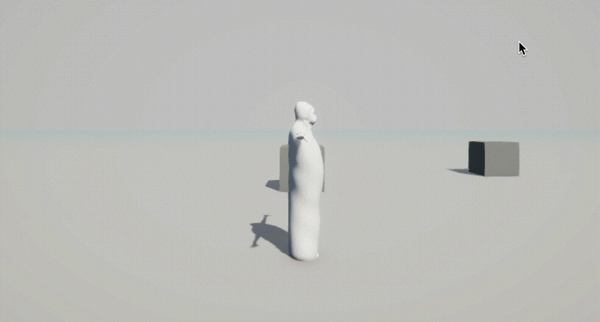
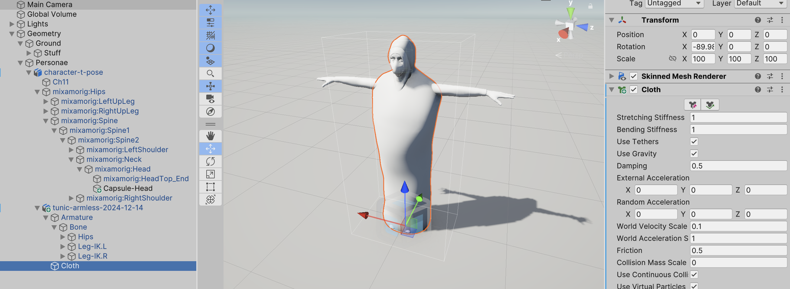

# Process
J'ai fait plusieurs essais depuis deux jours dans Unity de mettre des animations venant de Mixamo, puis de rajouter un composant Cloth sur le vêtement. J'ai eu plusieurs soucis, comme celui-ci :

Voici la configuration actuelle de l'illustration au dessus que je rappelle ne marche pas correctement :

Je pense que je ne suis pas loin, mais il faut trouver la bonne logique. Je pense que la prochaine chose à essayer c'est :

- Créer l'armature dans Blender
- Ajouter un corps associé à l'armature
- Ajouter un Cloth associé à l'armature
- Importer dans Unity
- Importer des animations de Mixamo ou autre
- Utiliser l'avatar `Humanoïd` de Unity pour adapter l'animation Mixamo au personnage
