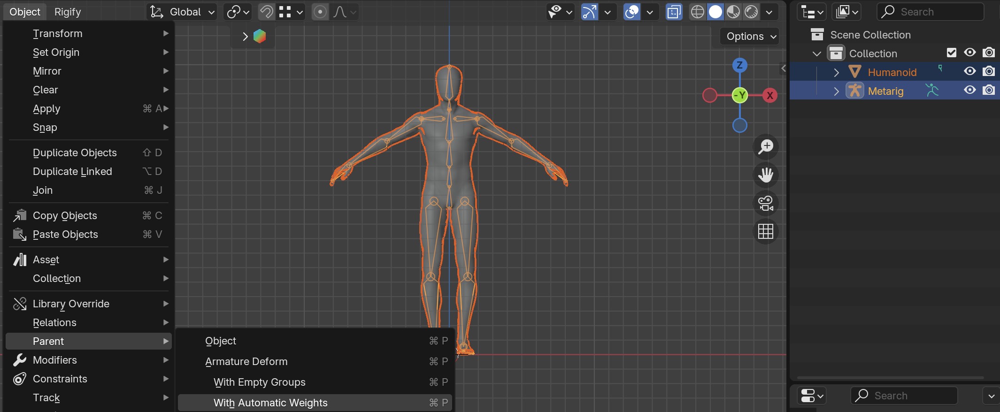
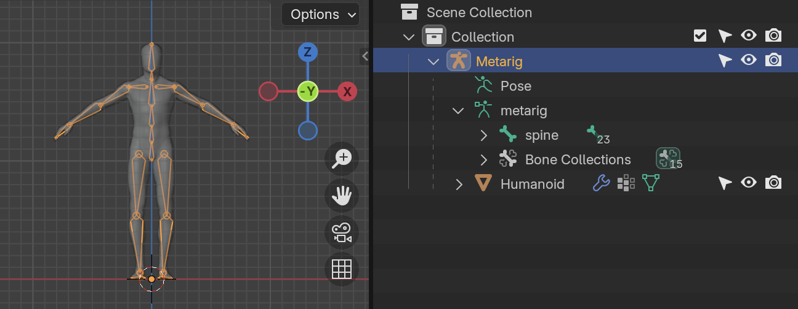
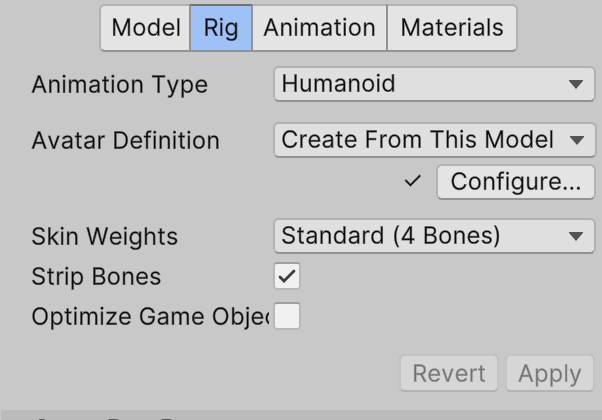
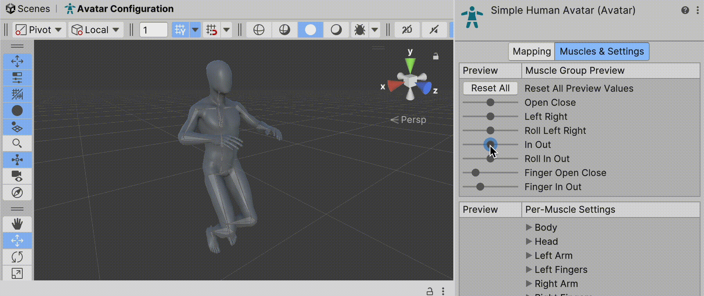

# Process
J'ai besoin de recommencer et épurer le process.

## Simple Human
Voici le workflow actuel :

- Importer un corps d'humain: [rigging-starter.blend](/blender/tutoriels/rigging/rigging-starter.blend)
	- Vérifier que le corps a 2 unités de taille
	- Vérifier que l'échelle est appliqué (`Object` > `Apply` > `Scale`). On peut aussi appliquer tous les `Transform`
- Créer un `Metarig`: `Add` > `Armature` > `Rigify Meta-Rigs` > `Basic` > `Basic Human`
- Positionner les os
	- Enlever `Breast`
	- Enlever les deux os autour du `Hips` qui aident le skinning et l'animation dans Blender, mais ne seront pas utilisés dans Unity
	- Fusionner les deux bones `Neck` en sélectionnant le joint et effacer avec la touche `x` > `Dissolve Bones`
- Relier le `Mesh` à l'armature:
	1. `Object Mode`
	2. Sélectionner le `Rig`
	3. `Shift` + sélect l'`Humanoïd` (`Rig` est orange, `Humanoïd` est rouge)
	4. `Object` > `Parent` > `Armature Deform` > `with Automatic Weights`

L'hiérarchie devrait avoir l'humanoide à l'intérieur de l'armature (ici appelé `Metarig`).

Avec ce réglage, à l'importation dans Unity on sélectionne l'onglet `Rig` et lui attribue `Animation Type` > `Humanoid`.

Si on sélectionne `Configure`, on peut vérifier dans `Avatar Configuration` que tous les os fonctionnent correctement :

