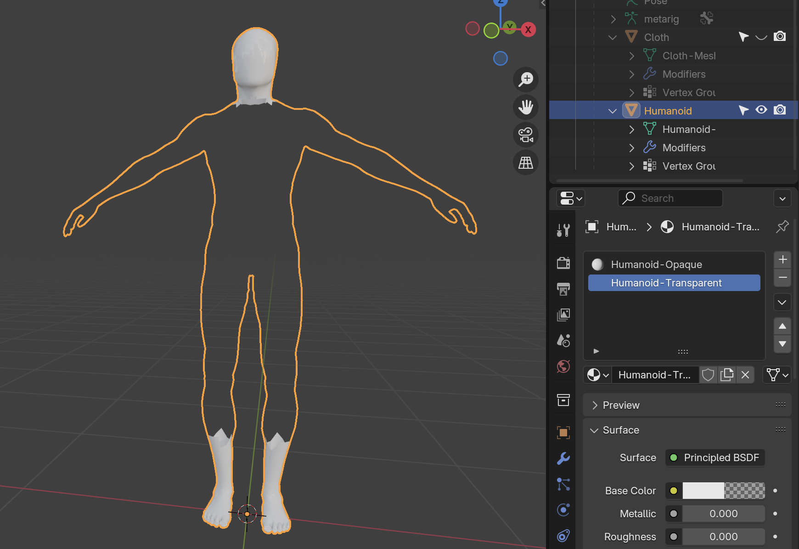

# Process
J'ai besoin de recommencer et épurer le process.

## Simple Human

### Blender > Unity
Voici le workflow actuel :

- Importer un corps d'humain: [rigging-starter.blend](/blender/tutoriels/rigging/rigging-starter.blend)
	- Vérifier que le corps a 2 unités de taille
	- Vérifier que l'échelle est appliqué (`Object` > `Apply` > `Scale`). On peut aussi appliquer tous les `Transform`
- Créer un `Metarig`: `Add` > `Armature` > `Rigify Meta-Rigs` > `Basic` > `Basic Human`
- Positionner les os
	- Enlever `Breast`
	- Enlever les deux os autour du `Hips` qui aident le skinning et l'animation dans Blender, mais ne seront pas utilisés dans Unity
	- Fusionner les deux bones `Neck` en sélectionnant le joint et effacer avec la touche `x` > `Dissolve Bones`
- Relier le `Mesh` à l'armature:
	1. `Object Mode`
	2. Sélectionner le `Rig`
	3. `Shift` + sélect l'`Humanoïd` (`Rig` est orange, `Humanoïd` est rouge)
	4. `Object` > `Parent` > `Armature Deform` > `with Automatic Weights`

L'hiérarchie devrait avoir l'humanoide à l'intérieur de l'armature (ici appelé `Metarig`).

### Unity Import

Avec ce réglage, à l'importation dans Unity on sélectionne l'onglet `Rig` et lui attribue `Animation Type` > `Humanoid`.

Si on sélectionne `Configure`, on peut vérifier dans `Avatar Configuration` que tous les os fonctionnent correctement :

### Add Cloth
Importer le cloth dans ce projet :

Comme au dessus dans [Unity Import](#Unity-Import), on peut tester le résultat avec les vêtements :

Voici tout ça avec un `AnimationController` et `RootMotion` activé :

### Cacher les bras
J'ai assigné (`Edit Mode` > Selectionner vertices > `Material` > `Humanoid-Transparent` > `Assign`) une couleur transparente dans presque tout le corps.

Il ne reste que le visage et les pieds visibles.

Voici le résultat dans Unity, lorsque le personnage marche :

*Note : il y a trop de vertices autour de l'épaule. Il faut réduire la géométrie autour de l'épaule. J'utiliserai le mode `Sculpt` dans ce cas.*

### Lisser les épaules
*Attention :* j'ai lissé le vêtement autour des épaules mais j'avais oublié de refaire le `Object` > `Parent` > `Automatic Weights`. Du coup, même avec la nouvelle géométrie, les weights ont épousée l'ancienne forme.

*Nuance :* C'est mieux maintenant, mais comme les `Weights` automatiques veulent néanmoins épouser les bras (invisibles), le vêtement sort toujours un peu trop. Il faudrait corrigé ça à la main avec du `Weight Painting`. *À faire*.

### Bras croisés
Je veux modéliser le vêtement avec les bras croisés sur la poitrine du personnage. Pour qu'il garde cette pose, sans revenir au `Rest Position` j'ai activé le petit épingle dans le menu `Data Object Properties`.

Voici la version re-sculpté du `Cloth` avec les bras sur la poitrine :

### Clear Parent
Pour garder cette nouvelle forme, j'ai du d'abord enlever la nouvelle forme du `Cloth` avec `Object` > `Parent` > `Remove Parent and Keep Transformation`. Ensuite, j'ai pu re-attaché l'objet à l'armature avec l'armature en `Rest Position`, c'est-à-dire le `T-Pose`.

### Weight Paint
Pour corriger l'influence qui reste de l'haut du bras, j'ai changé les `Weight` dans `Weight Mode`.

Voici le processus pour la capture d'écran ci-dessus :

- Aller dans `Weight Paint Mode`
- Sélectionner le `UpperArm_R` ou `UpperArm_L`. Ces os ont des couleurs et déforme donc le `Mesh`
- Sélectionner `Weight 0.000` dans le UI pour cibler *aucune influence*
- On peint avec la brosse jusqu'à ce que tous les vertices soient bleus.

Avec ces nouveaux `Weight`, les bras à l'extérieur du vêtement (et qui seront invisibles) n'affectent plus le `Cloth` :

### Résultat Unity
Voici le résultat :

Il y a encore quelques détails qui ne marchent pas, dont :

- Une des jambes qui traverse le bas de la tunique
- L'intérieur de la tunique qui est toujours transparente. Je vais donc ajouter plus d'opacité sur corps autour du cou

## Unity Movement
Je veux créer un mouvement animé par la capture du mouvement et non pas par du code. Ce mouvement doit être pilotable par un composant `CharacterController`, pour que notre `NavMesh` puisse le piloter.

Il y a une excellente série de tutoriels sur YouTube qui est quasi-identique à l'approche que j'ai utilisé à l'époque de [A Crossing Industry](https://abstractmachine.net/en/posts/a_crossing-industry) (mais que je n'ai pas bien documenté) :

- [Root Motion Explained](https://www.youtube.com/watch?v=Xl_5roq4UlI&list=PLx7AKmQhxJFaBjiP5uxv7pJ_T2lMIZOBD&index=6)
- [Using Root Motion with a Character Controller](https://www.youtube.com/watch?v=mNxEetKzc04&list=PLx7AKmQhxJFaBjiP5uxv7pJ_T2lMIZOBD&index=8)

