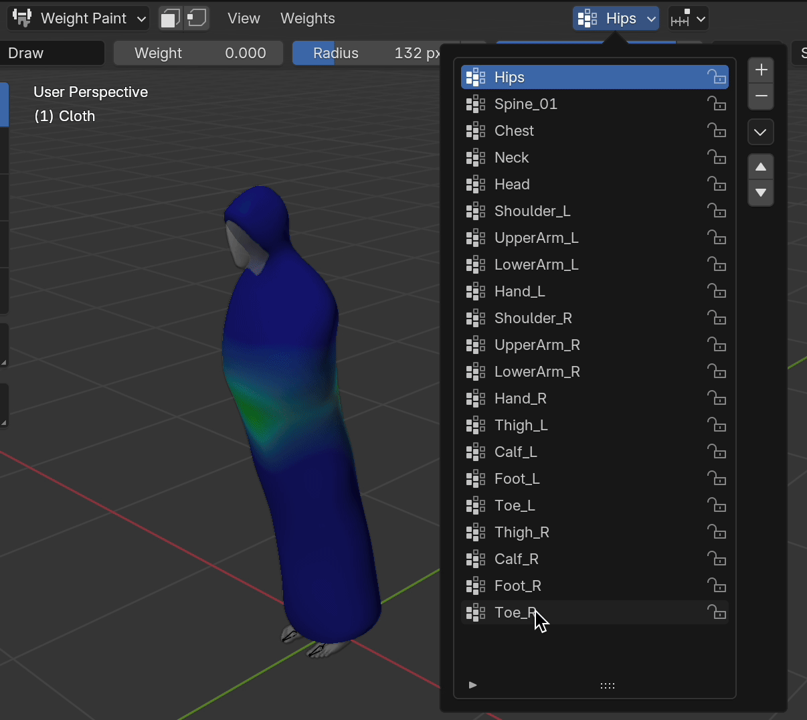
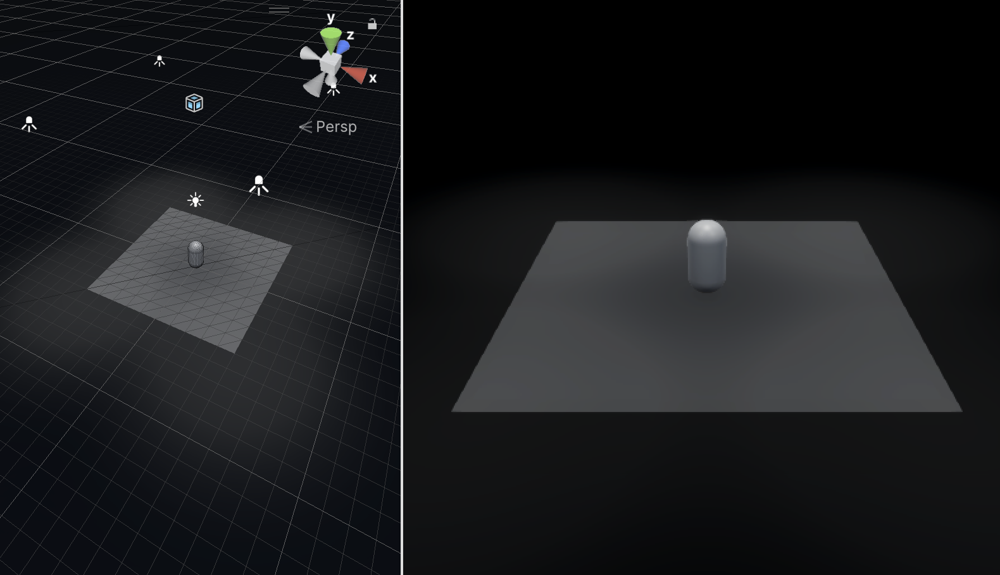
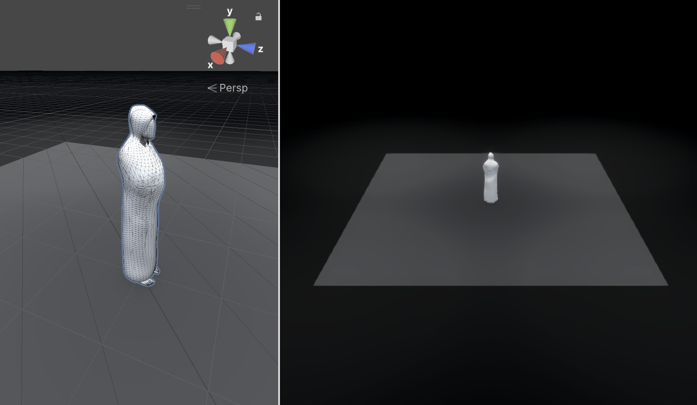
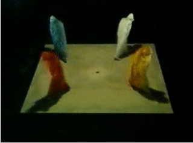
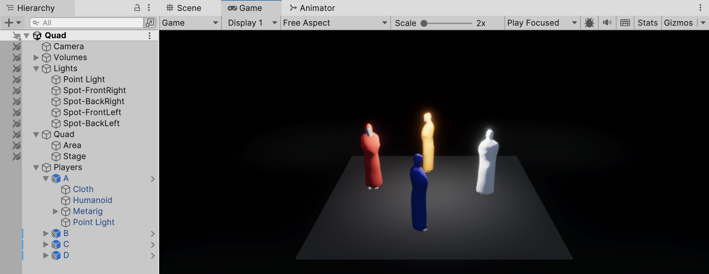
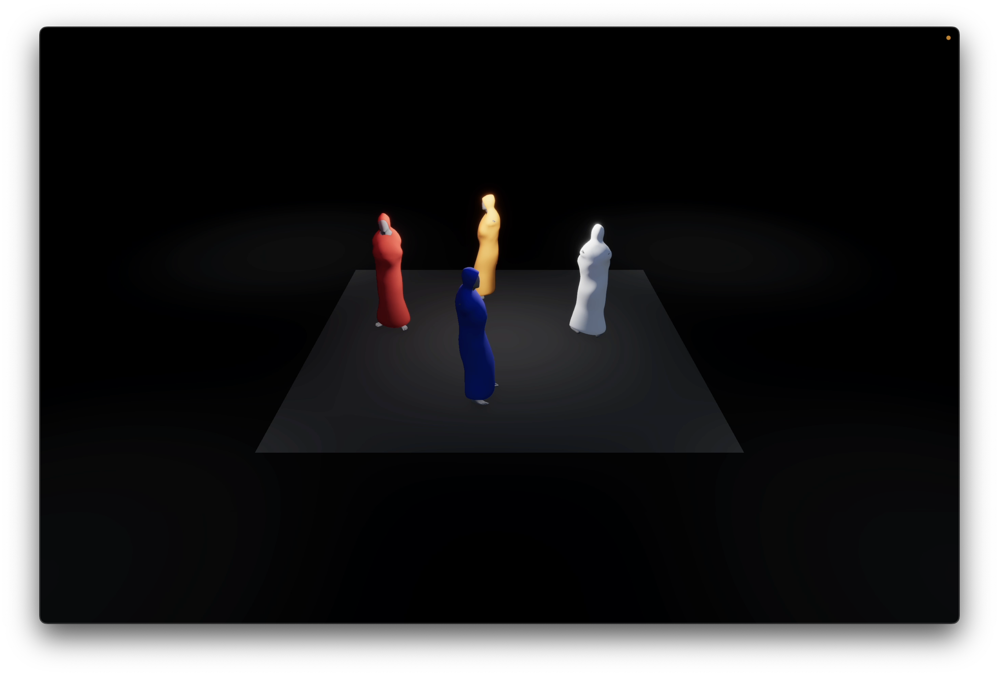
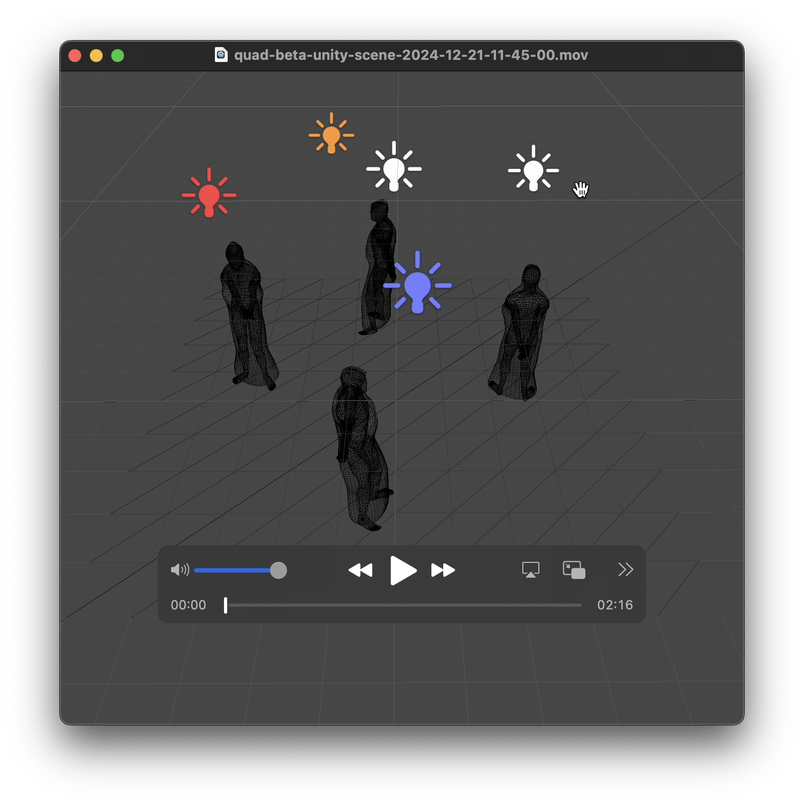
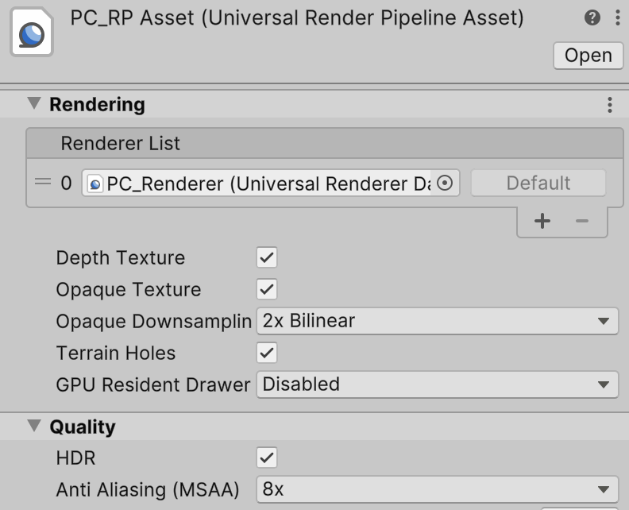
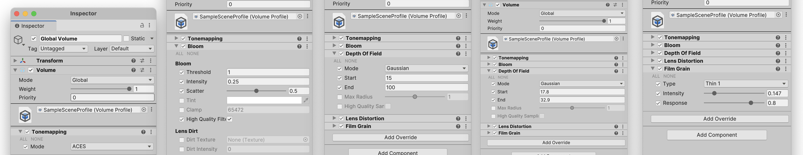
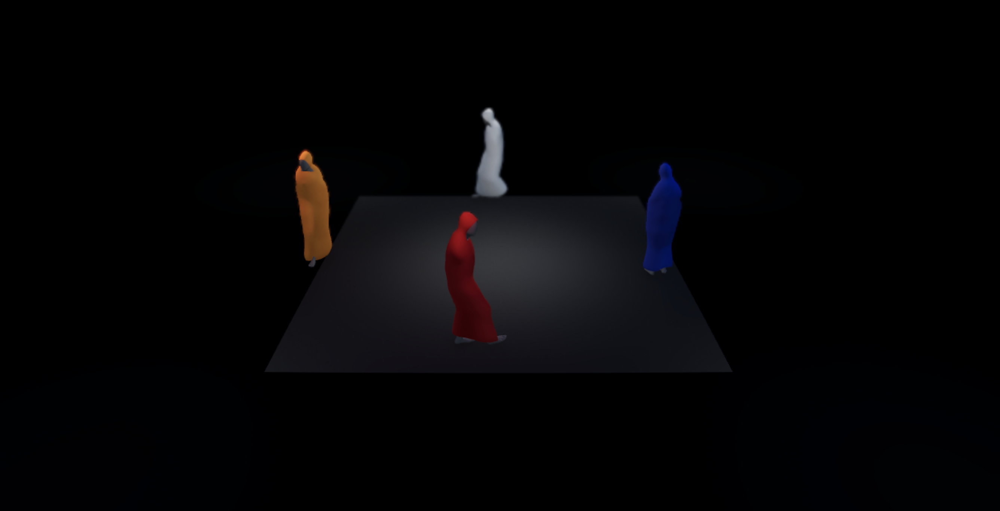

# Process
Petit rush de fin pour voir ce que j'arrive à faire. Actuellement je tente de :

- Créer un dossier projet final Unity
- Épurer les essais précédents en un projet Unity simple
- Ajouter des anims de base Mixamo pour un Blend Tree
	- T-Pose
	- Idle
	- Walk
- Créer un CharacterController à partir du tutoriel [Using Root Motion with a Character Controller](https://www.youtube.com/watch?v=mNxEetKzc04&list=PLx7AKmQhxJFaBjiP5uxv7pJ_T2lMIZOBD&index=8)

## Weight Painting
J'ai retravaillé les `Weight` pour qu'aucun os des deux bras ne puisse les influencer. Noter dans l'illustration que c'est entièrement bleu lorsque les os des bras sont sélectionnés.

## Lighting
J'ai créé une reconstruction assez basique du studio SDR de 1981.

## Personæ
J'ai ajouté un personnage. Il y a du coup une question d'échelle vis-à-vis l'original.

 

Pour rappel, voici une version 

## Prémier résultat
J'ai une première version semi-fonctionnelle, mais sans le pilotage par `CharacterController` et `NavMesh`. On ne respecte pas alors le schéma de Beckett : c'est juste des personnages qui marchent en cercle. L'animation vient [Mixamo](http://mixamo.com). Il s'agit d'une seule animation d'une personne qui marche en boucle.

Voici comment cette scène fonctionne :

Voici le résultat dans le rendu :

## App Beta
Voici deux liens d'enregistrements que je viens de téléverser sur YouTube :

## Post-Process
Après ce démo donné à midi, j'ai ajouté quelques réglages dans le composant `Post-Process` du `Global Volume` de `Unity` et aussi dans les réglages `Anti Aliasing` de l'asset `Universal Render Pipeline` (cf. illustration pour le nom exacte de l'asset) :

Voici la matrice actuelle du `Post-Process` :

Et l'image résultante :

## Textile
Le résultat actuel est assez convaincant, mais il manque quand-même une chose qui me semble essentiel : le pattern subtil d'un textile — coton, lin, peu importe. Il faut donc apprendre à créer des coutures, appliquer une texture de coton (ou autre) en respectant les coutures, puis arriver à exporter-importer entre `Blender` et `Unity`.

### Blender Kit
[Claudy](https://www.hesge.ch/head/annuaire/claudy-iannone) nous a fait installer [BlenderKit](https://www.blenderkit.com) pour avoir à notre disposition des textures complexes déjà configurés (textures hautes définition, bump map, displacement map, et cætera). Première chose à regarder donc : s'il y a un tissu coton (ou autre) facile à appliquer dans `Blender` via `BlenderKit`.