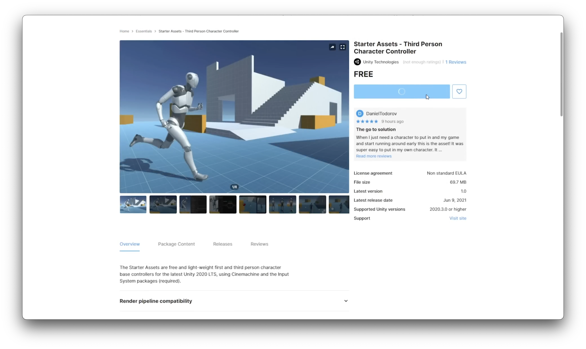
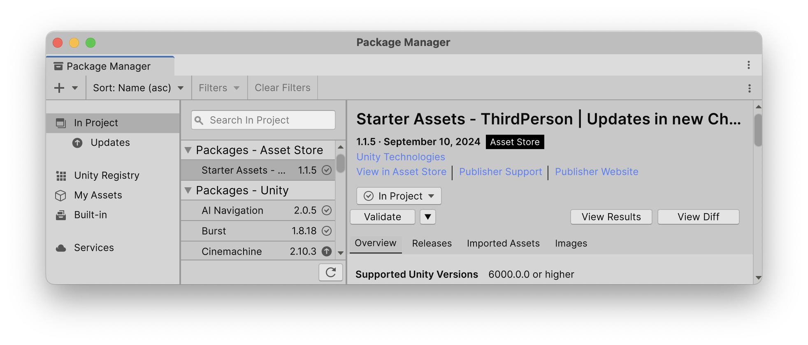
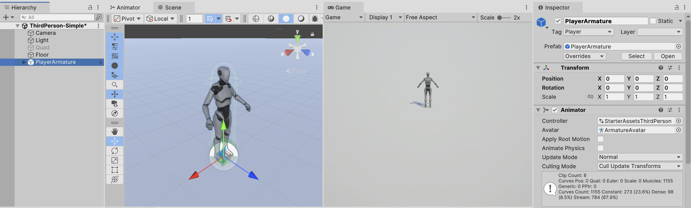
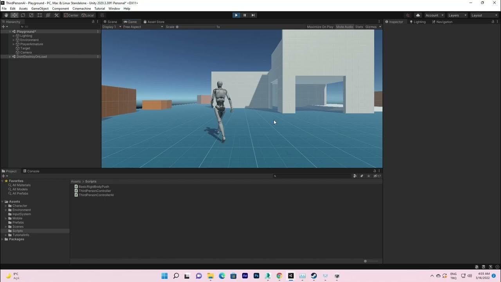
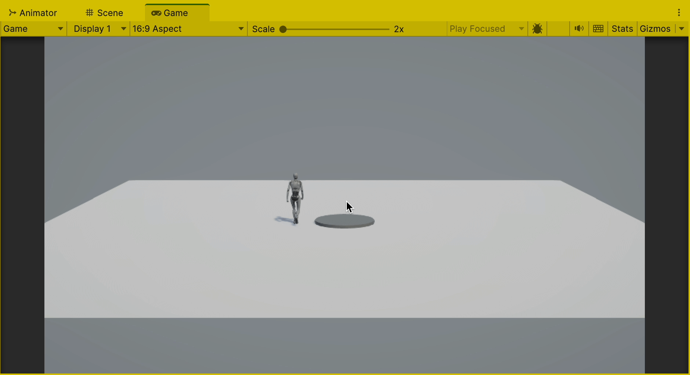

# Process
Avancement sur le projet. Premier objectif : les *players* doivent s'avancer selon le schéma de Beckett :


## Player
Beckett appelle les personæ des « Player ». Ce qui tombe bien pour un moteur de jeu. Je vais donc créer un `Player` pilotable par la partie olk-skool AI de Unity, les [NavMesh](https://docs.unity3d.com/ScriptReference/AI.NavMesh.html).

Pour cela, je vais passer à la création d'un [NavMeshAgent](https://learn.unity.com/tutorial/navmesh-agents) pour mes personnages. Cela va nécessiter aussi plus d'animations pour tous les mouvement du personnage. Pour cela je vais me baser sur le [Third Person Controller Starter Assets](https://assetstore.unity.com/packages/essentials/starter-assets-thirdperson-updates-in-new-charactercontroller-pa-196526#content) créé par [Unity](https://unity.com).

[](https://assetstore.unity.com/packages/essentials/starter-assets-thirdperson-updates-in-new-charactercontroller-pa-196526#content)

Je vais commencer par télécharger ce `starter assets` dans un autre projet, simplifier, puis créer mon propre `starter` projet, ou peut-être même un `Package` que je pourrais créer sous forme de `Release` [sur ce répot Github](http://github.com/abstractmachine/head-formation-blender/releases).

## Third Person Character Controller
Unity propose des personnages que l'on peut facilement ajouter à son projet via leur Unity Store. Ça s'appelle [Starter Assets Third Person Controller](https://assetstore.unity.com/packages/essentials/starter-assets-thirdperson-updates-in-new-charactercontroller-pa-196526#content). Il y a une scène démo, mais je vais plutôt commencer avec la configuration minimale.



1. Dans le `Package Manager`, activer `Starter Assets ThirdPerson`
2. Créer une Nouvelle scène : `Basic (URP)`
3. Poser un sol : `Hierarchy` > `+` > `3D Object` > `Plane`
4. Trouver le personnage ici : `Starter Assets` > `Third Person Controller` > `Player Armature`
5. Glisser ce personnage sur le `Scene`
6. Démarrer le jeu avec le bouton `Play`
7. Appuyer sur les touches du clavier ou utiliser une manette pour controler le petit bonhomme robot

Ça y est, on peut en quelques clics avoir un personnage contrôlable :



Bravo Unity. Tout ça était bien plus compliqué par le passé.

## NavMesh Agent
Essayons de trouver la version minimale d'un personnage piloté par un `NavMesh`. Nous allons suivre les infos donné par [Brackeys]() dans son tutoriel assez ancien [Unity NavMesh Tutorial - Basics](). Normalement ce tutoriel devrait toujours marcher.

1. Créer une nouvelle scène : `Basic (URP)`
2. Poser un sol : `Hierarchy` > `+` > `3D Object` > `Plane`
3. Poser un obstacle - ici ce sera un cylindre au milieu
4. Ajouter un composant `NavMeshObstacle` sur ce cylindre
	- Sélectionner `Carve` et `Carve Only Stationary`
5. Créer un `Empty` et lui donner un script `NavMeshSurface`
	- `Bake` le `NavMeshSurface`
	- On devrait voir le `NavMesh` qui évite l'obstacle
6. Créer un cylindre
	- J'ajoute souvent un « nez » sur ce cylindre pour mieux voir son orientation
7. Ajouter un `NavMeshAgent` sur ce cylindre
8. Ajouter un script qui donne des objectifs à l'agent. Ici, je vais le mettre sur la surface mais ça peut être fait d'autres manières.

Voici le script actuel. Puisqu'il y a une méthode `MouseDown`, il faut un `Collider` sur la surface :

```
using UnityEngine;
using UnityEngine.AI;

public class SetTarget : MonoBehaviour
{
	[SerializeField]
	private NavMeshAgent agent;
	[SerializeField]
	private Camera mainCamera;

	void OnMouseDown()
	{
		if (mainCamera != null)
		{
			// the ray shooting out from the center of the camera towards where we clicked on the screen
			Ray clickRay = mainCamera.ScreenPointToRay(Input.mousePosition);
			// this will be what we actually hit on our way there
			RaycastHit clickHit;
			// calculate all this and see if we actually got a hit
			if (Physics.Raycast(clickRay, out clickHit))
			{
				agent.SetDestination(clickHit.point);
			}
			// if (Physics)
		}
		// if (camera)
	}
	// OnMouseDown()

}
```

## Third Person Controller AI
Pour fusion ces deux méthodes, j'avais besoin de modifier le controleur de Unity pour le rendre compatible avec le `NavMesh`. La partie manquante était résulu par ce projet [Third Person Controller AI](https://github.com/ergin3d/ThirdPersonControllerAI) sur Github de [Ergin3D](https://www.youtube.com/@ergin3d). Il y a un tutoriel ici :

[](https://www.youtube.com/watch?v=x4TwKOVMfnk)

Je vais mélanger la partie [NavMeshAgent](#navmesh-agent) et [Third Person Character Controller](#third-person-character-controller) ci-dessus. Voici l'essentiel :

1. Effacer le cylindre
2. Glisser sur scène `Assets` > `Starter Assets` > `Third Person Controller` > `PlayerArmature`
3. Sélectionner `PlayerArmature` dans le `Hierarchy` et `clic-droit` > `Prefab` > `Unpack Completely`
4. Effacer :
	- `Third Person Controller (Script)`
	- `Basic Rigid Body Push (Script)`
	- `Start Asset Inputs (Script)`
	- `Player Inputs`
5. Ajouter :
	- `NavMeshAgent`
	- Ajuster `Base Offset` du `NavMeshAgent`, ici `-0.08`
	- Ajouter [ThirdPersonControllerAI.cs](https://github.com/ergin3d/ThirdPersonControllerAI/blob/main/ThirdPersonControllerAI.cs)
6. Il ne reste que :
	- `Transform`
	- `Animator`
	- `Character Controller`
	- `Nav Mesh Agent`
	- `Third Person Controller AI`
7. Créer un `Empty Object` qui s'appelle `Target`
	- Placer cet objet quelque part dans le monde
	- Attribuer le champ `Target` du `ThirdPersonControllerAI` avec cet `Empty Object`
	- Créer un script (ici appelé `SetThirdPersonTarget.cs`) qui positionnera l'objet `Target`
8. Créer un script avec une méthode appelé `OnFootstep()` pour faire des sons de bruit de pas, ici appelé `Walking.cs`, et le placer sur le `Player`

Voici le script `SetThirdPersonTarget.cs` :

```
using UnityEngine;

public class SetThirdPersonTarget : MonoBehaviour
{

	[SerializeField]
	private GameObject target;
	[SerializeField]
	private GameObject player;
	[SerializeField]
	private Camera mainCamera;

	void Start() {
		if (target != null)
		{
			// set target to player's position
			target.transform.position = new Vector3(player.transform.position.x, target.transform.position.y, player.transform.position.z);
		}
	}

	public void OnMouseDown()
	{
		if (mainCamera != null)
		{
			// the ray shooting out from the center of the camera towards where we clicked on the screen
			Ray clickRay = mainCamera.ScreenPointToRay(Input.mousePosition);
			// this will be what we actually hit on our way there
			RaycastHit clickHit;
			// calculate all this and see if we actually got a hit
			if (Physics.Raycast(clickRay, out clickHit))
			{
				// set position of target on X & Z axis to where we clicked
				target.transform.position = new Vector3(clickHit.point.x, target.transform.position.y, clickHit.point.z);
			}
			// if (Physics)
		}
		// if (camera)
	}
	// OnMouseDown()

}
```

Voici le script `Walker.cs` :

```
using UnityEngine;

public class Walker : MonoBehaviour
{
	public void OnFootstep()
	{
		Debug.Log("Footstep " + gameObject.name);
	}
}
```

Voici le résultat final :


