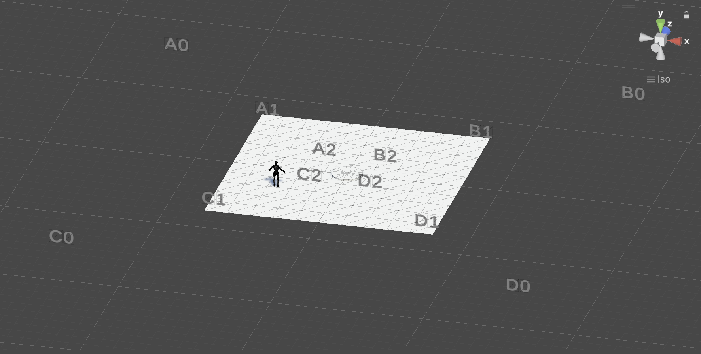

# Process
J'ai réussi à configurer les `CharacterController` pilotés par le `NavMesh`, le tout synchronisé avec le schéma de Beckett.

Voici, de nouveau le schéma de Beckett, et ma nomenclature dans Unity :




## Courses
Avec cette logique, j'ai conçu ma liste de « courses » de la façon suivante :

```
/*  Beckett's original script
	note: correction on #2 "CR" > "CB" (seems to make more sense, verify with French translation)
	Course 1: AC, CB, BA, AD, DB, BC, CD, DA
	Course 2: BA, AD, DB, BC, CD, DA, AC, CB
	Course 3: CD, DA, AC, CB, BA, AD, DB, BC
	Course 4: DB, BC, CD, DA, AC, CB, BA, AD
	*/
	
	Dictionary<string, List<string>> courses = new Dictionary<string, List<string>>()
	{
		{ "1", new List<string> {"A0", "A1", "C1", "C2", "D2", "B2", "B1", "A1", "A2", "C2", "D2", "D1", "B1", "B2", "A2", "C2", "C1", "D1", "D2", "B2", "A2"} },
		{ "2", new List<string> {"B0", "B1", "A1", "A2", "C2", "D2", "D1", "B1", "B2", "A2", "C2", "C1", "D1", "D2", "B2", "A2", "A1", "C1", "C2", "D2", "B2"} },
		{ "3", new List<string> {"C0", "C1", "D1", "D2", "B2", "A2", "A1", "C1", "C2", "D2", "B2", "B1", "A1", "A2", "C2", "D2", "D1", "B1", "B2", "A2", "C2"} },
		{ "4", new List<string> {"D0", "D1", "B1", "B2", "A2", "C2", "C1", "D1", "D2", "B2", "A2", "A1", "C1", "C2", "D2", "B2", "B1", "A1", "A2", "C2", "D2"} }
	};
```

## Demo
Avec du code qui dit à chaque `Player` de commencer avec le premier `Target`, puis d'avancer au prochain, puis répéter l'ensemble, cela donne ceci :


*Noter que les `Target` sont atteints d'une manière une peu approximatifs (la distance actuel == 1.0f) et qu'il faudrait aussi synchroniser les longueurs de courses pour que tout le monde marche avec la même durée et cadence.*

## Scenario.cs
```
using UnityEngine;
using System.Collections.Generic;
using StarterAssets;

public class Scenario : MonoBehaviour
{

	/* Beckett's original script
	   note: correction on #2 "CR" > "CB" (seems to make more sense, verify with French translation)
	Course 1: AC, CB, BA, AD, DB, BC, CD, DA
	Course 2: BA, AD, DB, BC, CD, DA, AC, CB
	Course 3: CD, DA, AC, CB, BA, AD, DB, BC
	Course 4: DB, BC, CD, DA, AC, CB, BA, AD
	*/
	
	Dictionary<string, List<string>> courses = new Dictionary<string, List<string>>()
	{
		{ "1", new List<string> {"A0", "A1", "C1", "C2", "D2", "B2", "B1", "A1", "A2", "C2", "D2", "D1", "B1", "B2", "A2", "C2", "C1", "D1", "D2", "B2", "A2"} },
		{ "2", new List<string> {"B0", "B1", "A1", "A2", "C2", "D2", "D1", "B1", "B2", "A2", "C2", "C1", "D1", "D2", "B2", "A2", "A1", "C1", "C2", "D2", "B2"} },
		{ "3", new List<string> {"C0", "C1", "D1", "D2", "B2", "A2", "A1", "C1", "C2", "D2", "B2", "B1", "A1", "A2", "C2", "D2", "D1", "B1", "B2", "A2", "C2"} },
		{ "4", new List<string> {"D0", "D1", "B1", "B2", "A2", "C2", "C1", "D1", "D2", "B2", "A2", "A1", "C1", "C2", "D2", "B2", "B1", "A1", "A2", "C2", "D2"} }
	};

	public string courseId = "";
	public int courseIndex = 0;

	public bool isActive = false;
	// create a keyboard activation key
	public KeyCode activationKey;

	[SerializeField]
	private GameObject target;

	// get the CharacterController component
	CharacterController controller;


	void Start()
	{
		controller = GetComponent<CharacterController>();
		// tell this player to jump to the starting position
		JumpToStartingPosition();
	}
	// Start()


	void Update()
	{
		// if we've pressed the activation key
		if (Input.GetKeyDown(activationKey))
		{
			// toggle the active state
			isActive = !isActive;
		}

		// if we are not active
		if (isActive)
		{	// update the active state
			UpdateActive();
		}
	}
	// Update()


	void UpdateActive()
	{
		// how far are we from the target?
		float distance = Vector3.Distance(controller.transform.position, target.transform.position);
		// if we are close enough to the target
		if (distance < 1.0f)
		{
			// get the next target position
			courseIndex += 1;
			// is this outside the bounds of the list?
			if (courseIndex >= courses[courseId].Count)
			{
				// reset the index to 1 (jump over the starting position)
				courseIndex = 1;
			}
			// get the GameObject related to this index
			GameObject currentTarget = GetCurrentTarget();
			// set the target to the index's position
			target.transform.position = currentTarget.transform.position;
		}
	}
	// UpdateActive()


	void JumpToStartingPosition()
	{
		// set our position to the starting GameObject
		GameObject currentObject = GetCurrentTarget();
		// set the position of the CharacterController to the position of the current target
		controller.transform.position = currentObject.transform.position;
		// also set the target to this position on X & Z axis
		target.transform.position = new Vector3(currentObject.transform.position.x, target.transform.position.y, currentObject.transform.position.z);
		// tell the third person character controller AI that it's target is the target GameObject
		GetComponent<ThirdPersonControllerAI>().Target = target.transform;
	}
	// JumpToStartingPosition()


	// create a public function to get the GameObject of current state
	GameObject GetCurrentTarget()
	{
		// make sure we have an id
		if (courseId == "")
		{
			Debug.LogError("No course ID set");
			return null;
		}
		// get the current course
		string currentTargetName = courses[courseId][courseIndex];
		// find the GameObject with this name
		GameObject currentObject = GameObject.Find(currentTargetName);
		// // return the current object
		return currentObject;
	}
	// GetCurrentTarget()

}
// class Scenario
```