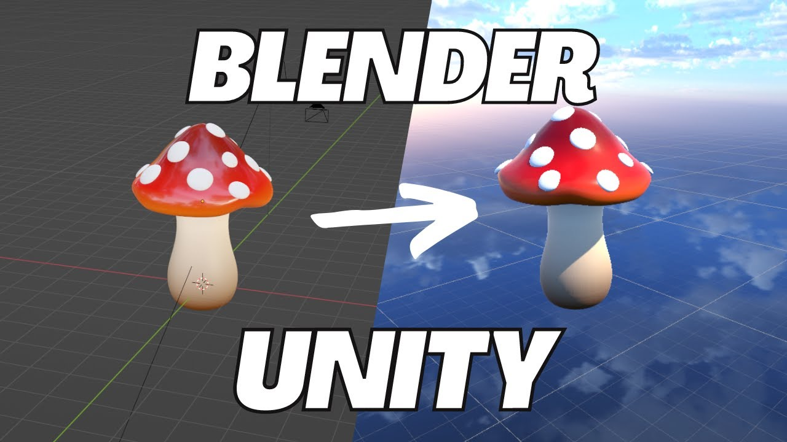

# Unity
Voici quelques notes sur le travail entre Blender et Unity.

## Exportation
Unity ne connaît pas le système nodal des `renderer` Blender. Voici un tutoriel qui explique comment `bake` divers textures/effets/etc de Blender dans une texture avant l'exportation en `FBX` et importation dans Unity :

