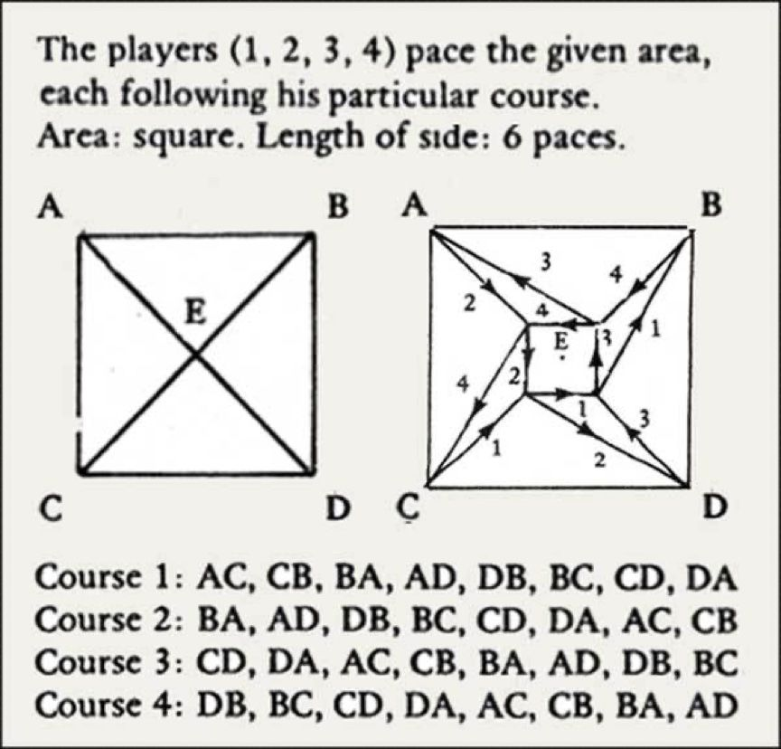

# Quad
Une adaptation de l'emission [Quad](https://en.wikipedia.org/wiki/Quad_(play)) (play), écrit et réalisé par [Samuel Beckett](https://fr.wikipedia.org/wiki/Samuel_Beckett) en 1981.

## Adaptation

## Quad
> Quad is a television play by Samuel Beckett, written and first produced and broadcast in 1981. It first appeared in print in 1984 where the work is described as "[a] piece for four players, light and percussion" and has also been called a "ballet for four people." – [Quad (play)](https://en.wikipedia.org/wiki/Quad_(play)), Wikipedia

## Vidéos

## Schéma

## Références

- [Samuel Beckett](https://fr.wikipedia.org/wiki/Samuel_Beckett), [Quad](https://en.wikipedia.org/wiki/Quad_(play)) (play), 1981
- [Samuel Beckett](https://fr.wikipedia.org/wiki/Samuel_Beckett), [Quadrat I + II](https://www.youtube.com/watch?v=4ZDRfnICq9M) (TV), Süddeutscher Rundfunk, 8 October 1981
- [Samuel Beckett](https://fr.wikipedia.org/wiki/Samuel_Beckett), [Quad et autres pièces pour la télévision](http://www.leseditionsdeminuit.fr/livre-Quad_et_autres_pièces_pour_la_télévision-1524-1-1-0-1.html), Les éditions de minuit, 1992
- [Épisode 4/4 : Beckett, l’épuisé](https://www.radiofrance.fr/franceculture/podcasts/les-chemins-de-la-philosophie/beckett-l-epuise-9006976), dans la série « Deleuze et la littérature », [Les chemins de la philosophie](https://www.radiofrance.fr/franceculture/podcasts/les-chemins-de-la-philosophie), 8 décembre 2018
- [Julien Murphet](https://researchers.adelaide.edu.au/profile/julian.murphet), [Understanding Quad](https://www.manchesterhive.com/display/9781526145840/9781526145840.00017.xml), in [Beckett and Media](https://www.manchesterhive.com/display/9781526145840/9781526145840.xml), 22 mars 2022
- Adrien Switzer, [Beckett’s Image of Exhaustion: The Late Television Plays](https://www.pismowidok.org/en/archive/2023/37-images-of-exhaustion/becketts-image-of-exhaustion-the-late-television-plays), in [View. Theories and Practice of Visual Culture](https://www.pismowidok.org/en/index)

## Technologies
- [Blender](https://www.blender.org/download/) 4.2.3
- [Rigify](https://docs.blender.org/manual/en/2.81/addons/rigging/rigify.html)
- [Unity](https://unity.com) 6

## Tutoriels
- [Polyfjord](https://www.youtube.com/@Polyfjord), [My New Rigging Workflow in Blender](https://www.youtube.com/watch?v=BiPoPMnU2VI&list=PL2DcM9Gsef16GjHLpFtYS1A0iBlsCoq6G&index=10), 12 décembre, 2022