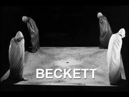
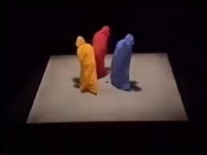
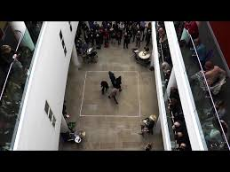
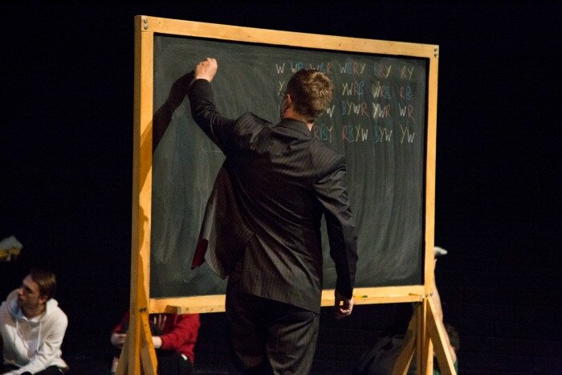
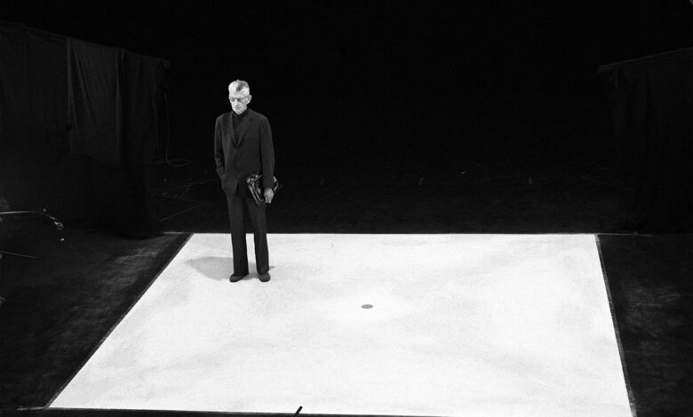
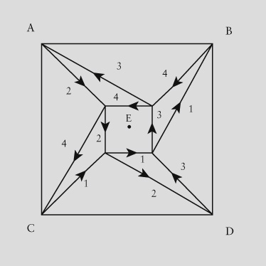

# Quad

## Projet
Une adaptation de l'emission [Quad](https://en.wikipedia.org/wiki/Quad_(play)) (play), écrit et réalisé par [Samuel Beckett](https://fr.wikipedia.org/wiki/Samuel_Beckett) en 1981.

## Adaptation
Ce projet sera l'adaptation de la pièce pour télévision [Quad](https://en.wikipedia.org/wiki/Quad_(play)), écrit et réalisé par Samuel Beckett pour le Süddeutscher Rundfunk, le 8 octobre 1981. Dans cette réalisation, quatre personnages de quatre couleurs différentes déambulent autour d'un carré, alternant leurs mouvements entre rapprochement au centre et éloignement vers les quatre coins du carré. Une musique rythmée accompagne la déambulation.

Dans cette adaptation, je modéliserai d'abord les quatre personnages de la pièce dans Blender. J'ajouterai ensuite une armature à ces personnages à l'aide de [Rigify](https://docs.blender.org/manual/en/2.81/addons/rigging/rigify.html). Enfin, j'animerai leurs mouvements avec les outils d'animation de Blender.

Le résultat de toutes ces étapes sera importé dans [Unity](https://unity.com), où je controllerai le mouvement des personnages via de la programmation en C#, en suivant rigoureusement les diagrammes écrites par Beckett dans la pièce originale.

Le but de ce projet est de mieux maîtriser la passage de la modélisation 3d dans Blender avec un résultat final dans un game engine où les personnages sont controllés en temps réel.

## Vidéos

## Quad
> Quad is a television play by Samuel Beckett, written and first produced and broadcast in 1981. It first appeared in print in 1984 where the work is described as "[a] piece for four players, light and percussion" and has also been called a "ballet for four people." – [Quad (play)](https://en.wikipedia.org/wiki/Quad_(play)), Wikipedia

## I & II
Pendant le tournage, une variante — « Quadrat II » — a été improvisé sur le plateau par Beckett lorsqu'il a vu un moniteur de contrôle qui permettait d'étalonner les caméras avec une image en noir et blanc. Dans cette variante, la musique et les couleurs ont disparu et les personnages traînent les pieds laborieusement. Beckette a déclaré : « Between the two parts there is an intermission of 100'000 years ».

## Schéma

[Schéma plus détaillé](images/quad-labelled.jpg)

## Personnage
Les personnages portent des robes avec des capuches; ces deux parties ont la même couleur : blanc, rouge, bleu, ou jaune — selon le personnage. Dans le scénario original, il est indiqué qu'une lumière de la même couleur suit le personnage. Ceci était irréalisable en 1981, mais plutôt facile dans un moteur de jeu.

## Workflow
1. ~~Modélisation~~ Importation d'un personnage quelconque dans Blender (cette personne sera couverte par une robe + capuche)
2. Rigging (armature standard ou [Rigify](https://docs.blender.org/manual/en/2.81/addons/rigging/rigify.html))
	- *Attention à créer une armature (a) compatible avec Mixamo et (b) exportable vers le système [Mecanim](https://docs.unity3d.com/Manual/AnimationOverview.html) d'Unity
3. Création d'une robe autour du corps du personnage (cf. [2024-11-29](../process/2024-11-29.md))
	- Utiliser de la physique pour la forme/couture
	- Bonus si la robe peut bouger dans Unity, ce serait cool. Cf. le composant [Cloth](https://docs.unity3d.com/Manual/class-Cloth.html) dans Unity. Pour une démo, cf. ce [tutoriel cloth](https://www.youtube.com/watch?v=pZBEiS99VpM))
4. Importation d'animations [Mixamo](https://www.mixamo.com/) dans Blender
	- Nettoyage des mouvements
	- Création d'une bibliothèque de mouvements
	- *Attention à nommer l'armature dans un format exportable vers Unity*
5. Exportation du modèle + armature + animations vers Unity
6. Re-création de la pièce de Beckett dans Unity, en suivant le scénario

## Références
- Samuel Beckett, [Quad](https://rohandrape.net/ut/rttcc-text/Beckett1984d.pdf) (script), 1984
- Samuel Beckett, [Quad](https://en.wikipedia.org/wiki/Quad_(play)) (play), Wikipedia
- Samuel Beckett, [Quadrat I + II](https://www.youtube.com/watch?v=4ZDRfnICq9M) (TV), Süddeutscher Rundfunk, 8 October 1981
- Samuel Beckett, [Quad et autres pièces pour la télévision](http://www.leseditionsdeminuit.fr/livre-Quad_et_autres_pièces_pour_la_télévision-1524-1-1-0-1.html), Les éditions de minuit, 1992
- Gilles Deleuze, [L'épuisé](http://www.leseditionsdeminuit.fr/livre-Quad_et_autres_pièces_pour_la_télévision-1524-1-1-0-1.html), Les éditions de minuit, 1992
- [Beckett, l’épuisé](https://www.radiofrance.fr/franceculture/podcasts/les-chemins-de-la-philosophie/beckett-l-epuise-9006976), Épisode 4/4 dans la série « Deleuze et la littérature », [Les chemins de la philosophie](https://www.radiofrance.fr/franceculture/podcasts/les-chemins-de-la-philosophie), 8 décembre 2018
- [Quad](https://www.panpantheatre.com/shows/quad), Pan Pan Theatre, 2013
- [Julien Murphet](https://researchers.adelaide.edu.au/profile/julian.murphet), [Understanding Quad](https://www.manchesterhive.com/display/9781526145840/9781526145840.00017.xml), in [Beckett and Media](https://www.manchesterhive.com/display/9781526145840/9781526145840.xml), 22 mars 2022
- Adrien Switzer, [Beckett’s Image of Exhaustion: The Late Television Plays](https://www.pismowidok.org/en/archive/2023/37-images-of-exhaustion/becketts-image-of-exhaustion-the-late-television-plays), in [View. Theories and Practice of Visual Culture](https://www.pismowidok.org/en/index)
- Samuel Beckett, [Filme für den SDR](https://www.suhrkamp.de/dvd/he-joe-quadrat-i-und-ii-nacht-und-traeume-schatten-geistertrio-t-9783518135037) (DVD), Suhrkamp Verlag, [978-3-518-13503-7](https://www.suhrkamp.de/dvd/he-joe-quadrat-i-und-ii-nacht-und-traeume-schatten-geistertrio-t-9783518135037), 2008
- Laura Salisbury, [Grey Time: Anachromism and Waiting for Beckett](https://edinburghuniversitypress.com/media/resources/9781474478519_Chapter_2.pdf), [9781474478519](https://library.oapen.org/handle/20.500.12657/92130), 2023

## Technologies
- [Blender](https://www.blender.org/download/) 4.2.3
	- [Rigging](https://www.blender.org/features/animation/#rigging) (*armature*)
	- [Rigify](https://docs.blender.org/manual/en/2.81/addons/rigging/rigify.html)
	- [Mixamo](https://www.mixamo.com/)
- [Unity](https://unity.com) 6
	- [NavMesh](https://docs.unity3d.com/ScriptReference/AI.NavMesh.html)
	- [Unity Audio Sequencer](https://github.com/Ludomancer/Unity-Audio-Sequencer) ou [FMOD](https://www.fmod.com/unity)

## Tutoriels
- [Rigify Fundamentals in Blender 4](https://www.youtube.com/playlist?list=PLdcL5aF8ZcJt1GvL-Fcxy-fPgEFG-1fLp)
- [Polyfjord](https://www.youtube.com/@Polyfjord), [My New Rigging Workflow in Blender](https://www.youtube.com/watch?v=BiPoPMnU2VI&list=PL2DcM9Gsef16GjHLpFtYS1A0iBlsCoq6G&index=10), 12 décembre, 2022